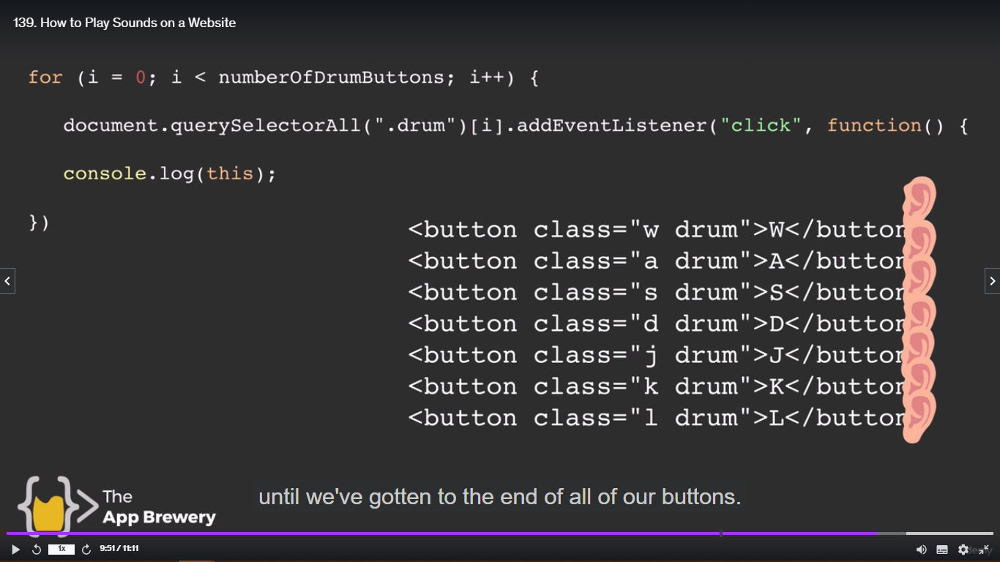
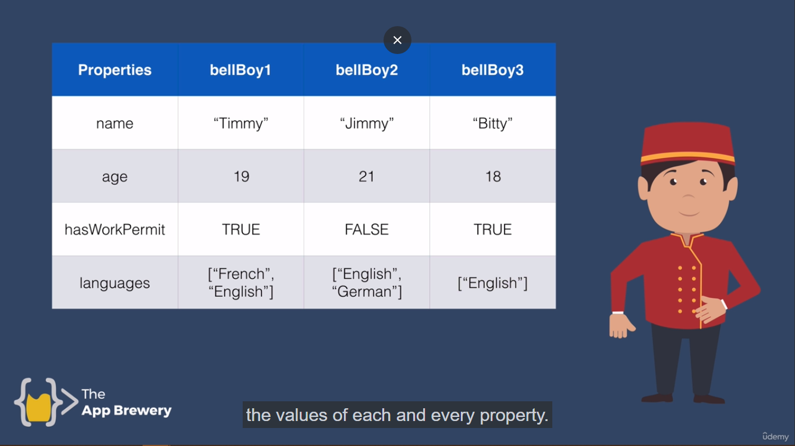
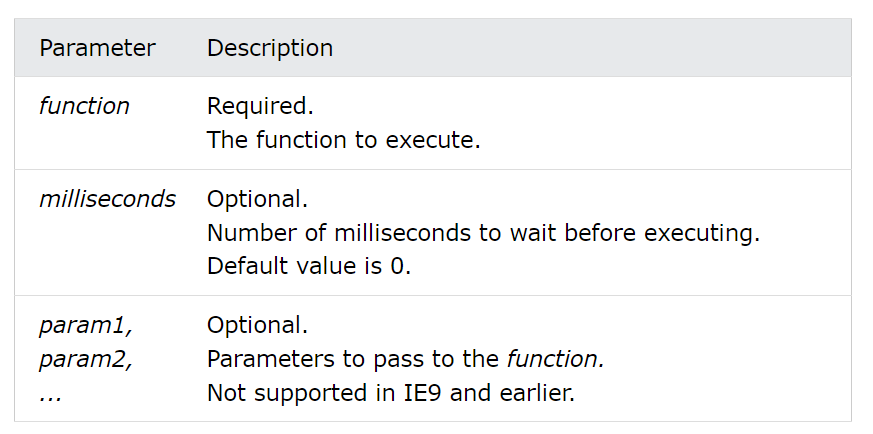

<h1 align="center" style="color: blue;">Advanced Javascript and DOM</h1>

## Adding Event Listeners to a Button

[Event Listener](https://developer.mozilla.org/en-US/docs/Web/API/EventTarget/addEventListener)
Button will let me know when the user click on that particular button.

The EventTarget method addEventListener() sets up a function to be called whenever the specified event is delivered to the target.

Here target is the object from where we are calling the object.
In our case it is **button** (document.querySelector("button")).

Syntax -

```js
target.addEventListener(type, listener[, options])
```

There are basically two parameters inside this addEventListener() function.

1.**Types** - A case-sensitive string representing the [event type](https://developer.mozilla.org/en-US/docs/Web/Events), which is in our case is simply "click".

2. **Listener** - The object which recieves the notification.
   It is a javascript fucntion.

Common targets are -

1. Elements
2. Document
3. Window

> **NOTE**
>
> The target may be any object that supports events.

```js
document.querySelector("button").addEventListener("click", handleClick);

function handleClick() {
  alert("I got clicked");
}
```

> In this case it will take the first button from the set of buttons present. And then it adds an event listener to that button so that it listens for click that happens on that button. And when it does it runs the code inside the function, handleClick and that should sens us an alert.

In above code we are not using **set of paranthesis** when the function is called inside the addEventListener function.

Why is that?

Let's say when we running our code in html, it will follow top to bottom approach until it hit the script tag. Inside the index.js file when it reaches the **document.querySelector("button").addEventListener("click", handleClick());** It find that handleClick is a function so it just called that straight up and **the alert prompt will appear instantly when we open our website instead of clicking on the **w** button and the alert prompt comes out. Now if you click on the w button no alert prompt will appear.**

> In short -
>
> We want the alert prompt to come out when and only the click has happen. So that's why we don't want to use the set of paranthesis inside the addEventListener **listner** function.

### Anonymous Functions -

Instead of writing the **handleClick** as an input inside the addEventListener function and will be called later on, when the handleClick function gets triggered. We can simply write it like -

```js
document.querySelector("button").addEventListener("click", function () {
  alert("Hello World");
});
```

Here the Anonymous function is called inside the addEventListener function. So no need to write the separate function and then naming it. Simply write as above code written.

Challenge -

Adding Event Listener to every singly button present inside the html.

```js
for (var i = 0; i < document.querySelectorAll(".drum").length; i++) {
  document.querySelectorAll(".drum")[i].addEventListener("click", function () {
    alert("Hello World");
  });
}
```

> **NOTE**
>
> Until and unless you want to apply to the alert prompt to every button is good to use **class or id** to specify which set of button of element you really want to target. Let's say In future you add other buttons so the for loop will target other buttons also that you have created.

## High Order Functions and Passing Functions as an Argument

> **Definition of High Order Function**
>
> Higher Order Functions are functions that can take other functions as input. This features are available in a number of modern languages like Javascript, Pascal, Swift and C++ and other modern languages.

You can click on any heading in the webpage and then click on inspect. It will directly show you where it is written inside html.
There is **$0** associated with particular html tag. Let's say I open Javascript page on wikipedia. And then click on Javascript h1 element. And there you find **$0** sign in the right. On clicking you will get on to the console. Now from here you can add "addEventListener" option to that particular heading.

```js
$0.addEventListener("click", function () {
  console.log("I got clicked");
});
```

In this case we can use also use **named** Function instead of **anonymous** function. It's all by your choice.

> **NOTE**
>
> So from here we are seeing that addEventListener(input1, input2) takes two input as an argument, the first one specifying what event it should listen to, and the second one specifying what is should do once that event get detected.

This is a different kind of function as we are not just only passing strings or numbers we are passing functions as an input.

Let's demonstrate in deep how this **addEventListener** functions helps to pass the other function as an argument.

Example -

Let's make a simple calculator.

```js
// add function
function calculator(num1, num2) {
  return num1 + num2;
}
function calculator(num1, num2) {
  return num1 * num2;
}

// Here we have to change the calculator function again and again to do the operations allowed by the user.
// But this is not how normal calculator works.
// It will be a tedious task to always change the functions.
```

What can we do?

```js
function add(num1, num2) {
  return num1 + num2;
}

function multiply(num1, num2) {
  return num1 * num2;
}
// here passing function as an argument becomes handy.
function calculator(num1, num2, operator) {
  return operator(num1, num2);
}

// Now how do we call the function
// Instead of calling add(4, 5);
// we can do like this
calculator(4, 5, add);
// When add function is passed from here, It will be set the value of operator to add and the it will call add(num1, num2) from operator(num1, num2). And after adding the value it will simply return me the value.
```

> **NOTE:**
>
> Let's say your program get crashed or something because of your mistake. Now solving the answer what could possible go wrong in your head, use the debugger keyword to find the what is going on with your code line by line.

Example -

```js
debugger;
calculator(3, 4, multiply);
```

### Full Calculator Code -

```js
function add(num1, num2) {
  return num1 + num2;
}
function multiply(num1, num2) {
  return num1 * num2;
}
function divide(num1, num2) {
  return num1 / num2;
}
function subtract(num1, num2) {
  return num1 - num2;
}
function mod(num1, num2) {
  if (num2 === 0) {
    return null;
  } else {
    return num1 % num2;
  }
}

function calculator(num1, num2, operator) {
  return operator(num1, num2);
}

calculator(4, 6, mod);

// If you want to debug
debugger;
calculator(4, 7, subtract);
```

---

## How to play Sounds on a website.

The **Audio()** constructor creates and returns a new HTMLAudioElement which can be either attached to a document for the user to interact with and/or listen to, or can be used offscreen to manage and play audio.

This Audio() constructor has two property -
**1. Preload** - By Default **_Auto_**
**2. src** - User specified source of sound or **_null_**

Syntax -

```js
new Audio();
new Audio(url);
```

```js
function playAudio() {
  // this is creating a new object Audio and passing location of sounds into the constructor.
  var audio = new Audio("./sounds/tom-1.mp3");
  // Here we are calling the method play();
  audio.play();
}

for (var i = 0; i < document.querySelectorAll(".drum").length; i++) {
  document.querySelectorAll(".drum")[i].addEventListener("click", function () {
    playAudio();
  });
}
```

So what is actually going inside the code.

First document.querySelectorAll(".drum"), selects all the drum class. And now travelling from 0 to document.querySelectorAll(".drum")[i].length, we are adding addEventListener which is in this case **click** to every button.



Now after assigning all the buttons with eventListener now we have to check which button is actually get clicked. And when the button is get clicked it will triggered the function which is inside the addEventListener function as a parameter. And we will do this through **this** keyword.
Now it will perform the action which are provided in the **Anonymous** function.
Now we can store the value of **this** keyword in a variable and pass it as a parameters to a function called playAudio(). And then it will check if x == "w" then play this sound or if x == "s" then play this sound.

---

> **NOTE**
>
> Now, how would you identify that which button is clicked through addEventListener?
>
> **THIS** keyword is basically the identity of the button that triggered the event listener.

```js
function playAudio(x) {
  if (x == "w") {
    var audio = new Audio("./sounds/tom-1.mp3");
    audio.play();
  }
  if (x == "a") {
    var audio = new Audio("./sounds/tom-2.mp3");
    audio.play();
  }
  if (x == "s") {
    var audio = new Audio("./sounds/tom-3.mp3");
    audio.play();
  }
  if (x == "d") {
    var audio = new Audio("./sounds/tom-4.mp3");
    audio.play();
  }
  if (x == "j") {
    var audio = new Audio("./sounds/snare.mp3");
    audio.play();
  }
  if (x == "k") {
    var audio = new Audio("./sounds/crash.mp3");
    audio.play();
  }
  if (x == "l") {
    var audio = new Audio("./sounds/kick-bass.mp3");
    audio.play();
  }
}

for (var i = 0; i < document.querySelectorAll(".drum").length; i++) {
  document.querySelectorAll(".drum")[i].addEventListener("click", function () {
    var x = this.innerHTML;
    playAudio(x);
  });
}
```

In this case there are a lot of **if** statements.
If there are more button if would be a tedious task.
Instead we will use **switch** statements. Switch statement will take the code down a different track depending on the value of a variable.

Syntax -

```js
function playAudio(x) {
  switch (x) {
    case "w":
      var audio = new Audio("./sounds/tom-1.mp3");
      audio.play();
      break;

    case "a":
      var audio = new Audio("./sounds/tom-2.mp3");
      audio.play();
      break;

    case "s":
      var audio = new Audio("./sounds/tom-3.mp3");
      audio.play();
      break;

    case "d":
      var audio = new Audio("./sounds/tom-4.mp3");
      audio.play();
      break;

    case "j":
      var audio = new Audio("./sounds/snare.mp3");
      audio.play();
      break;

    case "k":
      var audio = new Audio("./sounds/crash.mp3");
      audio.play();
      break;

    case "l":
      var audio = new Audio("./sounds/kick-bass.mp3");
      audio.play();
      break;
    // if the x is not any of the above statement, then default statement will execute which just break the statement and return nothing.
    default:
      break;
  }
}

for (var i = 0; i < document.querySelectorAll(".drum").length; i++) {
  document.querySelectorAll(".drum")[i].addEventListener("click", function () {
    var x = this.innerHTML;
    playAudio(x);
  });
}
```

## A Deeper Understanding of Javascript Objects

 

Basically this whole table is a **Class** name **BellBoy**.Class are the **blueprints or templates** for producing objects. Now this class will have methods as well as properties. Now the bellboy class has 4 different properties -

1. Name
2. Age
3. hasWorkPermit
4. Languages

Now what is object?

Objects are based on a blueprint of properties and methods (variable and functions) or (attributes or behaviour) defined as class.

Instead of creating a whote lot of bellboy with name "Timmy", "James" and so on. We can simply create the object BellBoy1, BellBoy2 and so on. Since the object are the copies of the class, we have also copy the properties and methods of the class. So now each Bellboy object has 4 propertes to assign.

Syntax for creating object in javascript

```js
var houseKeeper1 = {
  yearsofExperience: 12;
  name: "Jane",
  cleaningRepertoire = ["bathroom", "lobby", "bedroom"];
}
// Dot notation.
houseKeeper1.name;
```

Instead of writing down properties again and again for each bellboy. We can simply create the **Constructor** function and has all the given properties and methods for bellboy and the object will simply copy from the class.

> **NOTE:**
>
> The Constructor function must start with **capital** letter.

Syntax for Constructor function -

```js
function BellBoy(name, age, hasWorkPermit, languages) {
  this.name = name;
  this.age = age;
  this.hasWorkPermit = hasWorkPermit;
  this.languages = languages;
}
var bellBoy1 = new BellBoy("Timmy", 19, true, ["Frech", "English"]);
```

Constructor function for houseKeeper -

```js
function HouseKeeper(yearsofExperience, name, cleaningRepertoire) {
  this.yearsofExperience = yearsofExperience;
  this.name = name;
  this.cleaningRepertoire = cleaningRepertoire;
  this.cleaning = function () {
    alert("Cleaning in Progress...");
  };
}

var houseKeeper1 = new HouseKeeper(12, "Jane", [
  "bathroom",
  "lobby",
  "bedroom",
]);
var houseKeeper2 = new HouseKeeper(12, "James", ["bedroom"]);
houseKeeper2.clean();
```

Syntax for creating class and constructor in javascript.

```js
class Bellboy {
  constructor(name, age, workPermit, languages) {
    this.age = age;
    this.name = name;
    this.workPermit = workPermit;
    this.languages = languages;
  }
}

var BellBoy1 = new Bellboy("Jimmy", 19, yes, ["English", "French"]);
```

**_A lot of syntax are different in case of class Javascript than C++._**

### Now we just don't want only properties we also want methods.

Syntax for Creating Functions inside Constructor functions -

```js
function BellBoy(name, age, hasWorkPermit, languages) {
  this.name = name;
  this.age = age;
  this.hasWorkPermit = hasWorkPermit;
  this.languages = languages;
  this.moveSuitCase = function () {
    alert("May I take your suitcase");
    pickUpSuitCase();
    move();
  };
}

BellBoy.moveSuitCase();
```

**_Now if we see in the Audio() method we are calling in the drum challenge. The code will look like_** -

```js
var x = new Audio("./sounds/tom-1.mp3"); // Constructor function is called
Audio.play(); // Constructor function has a method called play();

function Audio(fileLocation) {
  this.fileLocation = fileLocation;
  this.play = function () {
    // Tap into the audio hardware
    // Check the file at fileLocation exists
    // Check the file at fileLocation is a sound file
    // Play the file at fileLocation.
  };
}
```

---

> **NOTE:**
>
> A Quick Note About the Next Lesson
> Hey guys,

TL;DR **keypress** is now deprecated, you should use **keydown** instead.

Just a quick heads up, as technology moves incredibly fast, every week or so something else will change. This is just a quick reminder that in the next lesson, when we cover detecting key presses, you should be using the **keydown** event listener instead of **keypress**.

## Using Keyboard Event Listeners to Check for Key presses

In case of addEventListener adding to button, it adds the addEventListener to the button when the click even is pressed.

**_But in case of Keyboard we will add addEventListener to the whole website._**

```js
document.addEventListener("keydown", function () {
  alert("Key was pressed!");
});
```

But now again the same thing how do we know which key was pressed.

We passed the parameter **\*event** or **_e_** to the Anonymous function when event is triggered. This event parameter will return us the bunch of the things like **whichKeyPressed**, **KeyCode** and **charCode** and so on. That's all we want.

**_The most important thing we want is which key is pressed._**
This is where we use the key property. This event paramenter has set of properties to look into.
One is **key**. It will return me the key pressed.

Syntax for which key pressed -

```js
document.addEventListener("keydown", function (event) {
  var x = event.key;
  playAudio(x);
});
```

For the whole code look for the Drum Challenge Problem inside the current folder.

## Understanding Callbacks and How to Respond to Events

**HigherOrderFunction** - Function which take other functions as input.
In this case **addEventListener** is a **HigherOrderFunction** which takes **respondToKey** function as an input.

```js
// Passing Named Function
document.addEventListener("keydown", respondToKey(event));

function respondToKey(event) {
  console.log(event);
  console.log("Key Pressed");
}
// Passing Anonymous Function
document.addEventListener("keydown", function (event) {
  console.log("Key Pressed");
});
```

Now what about the function which gets passed in as an input?

Well this is actually called a **Callback Function** because it allows to wait for something to finish. For example in the above case the Callback
function is waiting for a keypress event and the Callback function is called back and executed.

> **Summary**
>
> We basically are saying is that attach this event listener to html element of **$0** and get it to listen for **click** events, when it detects those click event get it to call this anonymous function.
> We can also get the **event** that triggered this function passed back through the callback function. The **event** in the above code is **click**.
> And when we triggered the click event it will return the value of the properties associated with that event.

### We can pass event, e, evt to the function as the name doesn't matter so much.

### Now In Deep we will understand what callback function is.

> **NOTE:**
>
> Let's say I created a addEventListener dummy to see what really happens inside teh addEventListener function.

```js
anotherAddEventListener("keypress", function (event) {
  console.log(event);
});
```

> Here we are calling anotherAddEventListener function which two parameters.
>
> 1.  TypeOfEvent - "keypress"
> 2.  Anonymous Function.
>
> This **Anonymous function** has a parameter which we simply print.
>
> Now how the anotherAddEventListener function looks like.

```js
function anotherAddEventListener(typeOfEvent, callback) {
  var eventThatHappened = {
    eventType: "keypress",
    key: "z",
    durationOfKeypress: 5,
  };
  if (eventThatHappened.eventType === typeOfEvent) {
    callback(eventThatHappened);
  }
}
```

> In the above code we have created a function anotherAddEventListener which take typeOfEvent and callback as an input.
>
> Callback is function which is simply a copy of Anonymous function that we have created while calling the anotherAddEventListener function.
>
> Now we create the object **eventThatHappened** and assign it some properties.
>
> If the property **eventType** of object **eventThatHappened** is equal to the parameter **typeOfEvent** then we can simply pass this object as a parameter to **callback** function.

```js
function callback(eventThatHappened) {
  console.log(eventThatHappened);
}
// This is same as
function (event) {
  console.log(event);
}
```

> Means callback function is callbacking the anonymous function and the value eventThatHappened is equal to event in the anonymous function. So it will simply console.log(event);

## Adding Animations to the Website

Let's create a function **buttonAnimation** for the animation effect. We are passing the function a **currentKey** parameter. This currentKey is equal to the the event value which is triggered. If it is a mouse or key.

Now how to distinguished on pressing key the animation will show.
We can simply add the class to the buttons.

> Already the pressed class css has been created inside the style.css.

```js
function buttonAnimation(currentKey) {
  var activeButton = document.querySelector("." + currentKey);
  activeButton.classList.add("pressed");
}
```

After adding the class when we will press the mouse or key it will show the animation as the button **faded out**. But how to remove the animation after a certain amount of time. Because if it is not remove this will create the website dull.

To do that we have function called [setTimeout()](https://www.w3schools.com/jsref/met_win_settimeout.asp).

This function has basically the syntax like -

```js
setTimeout(function, milliseconds, param1, param2, ...);
```

The parameter are -



So the code look like -

```js
function buttonAnimation(currentKey) {
  var activeButton = document.querySelector("." + currentKey);
  activeButton.classList.add("pressed");
  setTimeout(function () {
    activeButton.classList.remove("pressed");
  }, 100);
}
```

This **setTimout()** function has two input right now.

1. Anonymous Function -
   This function is used to remove the class **pressed** from the html.
2. Time - After how much time this animation will be turned off.

If I have to write the addEventListener to all the keypress inside the website using jquery

```js
$(document).keypress(function (event) {
  console.log(event.key);
});
```
