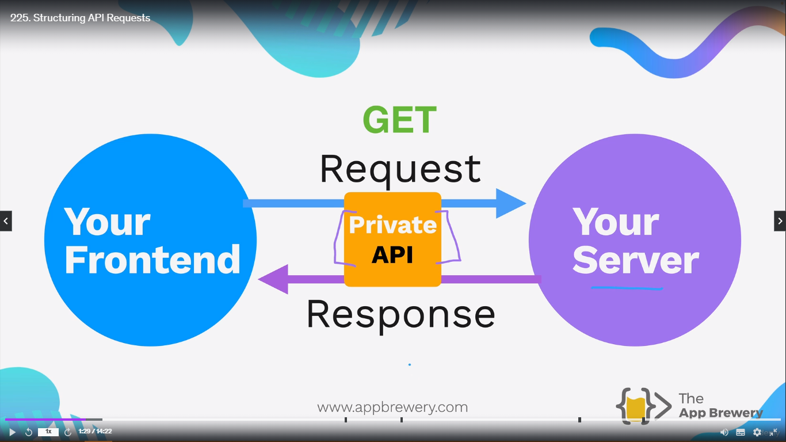
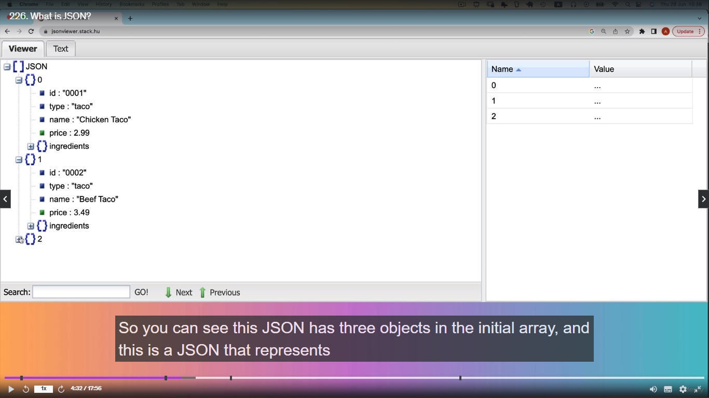

<h1 align="center" style="color: blue;">API (Application Programming Interface)</h1>

The technology that powers communication between software and internet.

API - These are the set of rules or protocols that defines how different software can interact with each other.

If let's say **Program A** and **Program B** wants to works together, then we would need them to be able to communicate to each other to share there functionality.

For Example -

1. Let Program A speaks chinese
2. Let Program B speaks Japanese

Now to able to make their communication happen is to simply put an API or **interface** between them. So the both program knows how to interact with each other through this bridge in the middle.
So what API does is it basically bridges the communication between different pieces of software.

Example -

Let's say I am creating a **Diary** Website where user can jot down all the important task into his website. Now when creating website I want to show a little icon with all the current weather details in the corner of the website.

Now when you look online you see a company called **OpenWeather** that stores and captures weather data and they have that weather data available in their database. And it's updated frequently and it's available for all the location of the world.

Now, what I need is just I want to be able to talk to these servers to bring their website data into my website.

Now how to set the communications between the OpenWeather Server and my server of Diary Website. Let's say OpenWeather servers use different language to make their backend servers. You don't know how to access their backend servers. You don't what the rules are that govern the servers.
And this is where **API** comes into play.

Now in this case OpenWeather creates a public API that tells you how you can interact with their services. If you want data from them, then there are these and these things that you can access.

For example, let's say if you pass in the latitude and longitude of the location you're interested in, well they can give you the weather of that particular location. They can tell you how that weather data is structured.

Data like -

```
{
  temp: 23*c
  icon: "cloudy"
}
```

All you have to do then is to make a request from your website through this API to say, well, these are the things that I want and because you now have this interface to know how to interact with their services, you're able to get this data back and populate it into your website.

In programming language, we are simple making a GET request from our website and in response the OpenWeather will give me set of data, and this API simply tells you how you can make these requests and how the data that's coming back is structured.

Example -
Let's say you created a tweet and you have a plant at home where every time you tweet your plant account, then you've got some sort of Arduino or IOT Devices that's going to water your plant. So how would this work?

Again through and API. You can create an API for your hardware which is watering devices, and you get to listen for request coming through the internet from your program. And when you monitor the account of your cacti or other plant when it sends a request to a particular path say /water, and when it sees that request, then it's going to start watering your plant.

In response from this API could be how much water was released or what is the moisture content of the soil and so on.

From all the examples above, API is an interface for the communication between two pieces of software.

### Different Types of API -

1. GraphQL
2. REST:API
3. SOAP
4. gRPC

Basically we've got different **architectural styles** for creating an API because essentially an API is just a set of rules and they each decide different rule of sets for creating API's.

We will study REST:API for this course

### What is RESTful API?

REST use HTTP protocols to interact with the API.

There is an API provided by International Space Station to know the exact location of ISS.

When you read the documentation provided by the ISS, it tells things to access to get the response from this API.

Example -

URL you need to access in order to interact with the API, and it tells what kind of response you can expect to get back. And it gives you a little piece of data on each of these endpoints. And figure out what is it you really want from an API you can figure out from given database.

**_Basically you can image your API documentation like a lunch menu where you pick, what do I want? And then you make a request through HTTP and depending on the type of request you make a POST request or maybe you need to make a GET request._**

### Goal - To locate the exact location of ISS.

POSTMAN - It is a really good tool for us to be able to make HTTP request without having front-end or back-end.

Just type this URL in postman [URL](https://api.wheretheiss.at/v1/satellites/25544)

You will get a JSON Data -

```json
{
  "name": "iss",
  "id": 25544,
  "latitude": 49.404658584906,
  "longitude": 108.37465137338,
  "altitude": 415.30893917869,
  "velocity": 27619.267151219,
  "visibility": "daylight",
  "footprint": 4483.5200307516,
  "timestamp": 1721219415,
  "daynum": 2460509.0210069,
  "solar_lat": 21.054421128074,
  "solar_lon": 353.99832146785,
  "units": "kilometers"
}
```

Now just take the value of longitude and latitude from the JSON data and paste it on google map. It will give you the exact location of ISS.

## Formatting API Request -

Let's say We are giving some GET request from frontend to backend and it is giving me some Response. Basically we are hitting a **private API** between these request and response to manage all the request and response. **Now the reason why it's private is because you don't document it for other people to use.**

Let's say some person know how your server was structured and tried to hit it up, that would be tapping into a private API, if there is some strong reason to do that.



Now behind the scene, your server is talking to another server to get some request and response from that particular server. And it is done through a PUBLIC API. Now this server has allowed this kind of behaviour to talk to another server through PUBLIC API. So they've documentated to how to use their public API. They've exposed certain parts of their server to anybody who wants to request it.


Refer to Bored-Api Documentation created by Angela [Bored-Api](http://bored-api.appbrewery.com)

The first thing when it comest to structuring you requests to these API's -
**1. API Endpoints** -
Syntax -

[BaseURL/Endpoint]

You have something BASEURL, and then you have api endpoints. These endpoint can be different for different purposes.

Example in bored-api -

There is **/random** endpoint where you can get hold of random activity when you are bored.
Ther is **/filer** endpoint, when you want to filter activities based on some sort of criteria.

**_And the endpoint is basically a different route on the API Provider Server and in the documentation they will usually give you an example of which endpoints you can use and what is the purpose of that endpoint._**

> **NOTE:**
>
> The most PUBLIC API that dont' require authentication, there's usually some method to prevent people from abusing the resources. So in our case, we've added a rate limit so that you can only make **100 request in 15 minutes** in bored-api. And after you make 100 request you have to wait for about 15 minutes to make another 100 request.

**2. Query Parameters** -

Syntax -

[bored-api.appbrewery.com/endpoint?query=value]

So basically we have first baseURL - "bored-api.appbrewery.com"
Then we have endpoint - "/endpoint"
Now we are adding "?" to say that we are adding a query now to the end of this request. This query has a **key-value** pair - "?query=value"

> Basically you put a query or a key/value pair into the URl when you want to provide some additional information or some Parameters to some request.
>
> Normally, when you're hitting up an API, they're used for filtering, sorting, searching.

You can have -

**3. Multiple Query Parameters** -

Syntax -

[bored-api.appbrewery.com/endpoint?query=value&query2=value]

We have our first query which is **?query=value** and then we our second query which is join by **&** and symbol and then **query2=value**.

To add a third query -

[bored-api.appbrewery.com/endpoint?query=value&query2=value&query3=value]

Example -

In bored-api documentation you have section called **Filter-Activities**. It basically returns a list of activities filtered by type and/or participants.

And it has two parameters to filter our activites by -

<ul>
  <li>
    type: choices from "education", "recreational" and so on.
  </li>
  <li>
    participants: choices from 1,2,3,4,5,6,8
  </li>
</ul>

**4. Path Parameters** -

Syntax -

[bored-api.appbrewery.com/endpoint/{path-parameter}]
[bored-api.appbrewery.com/endpoint/{unique-path-parameter}]

First come - BASEURL
Second come - /endpoint
Third come - Path-parameter {/Path-parameter}

The **/endpoint** never changes but after the endpoint **_we have forward slash and Path-Parameters where we can add some sort of parameters that does change, and this is usually to find some specific resource that exists._** So it could be an ID, it could be username. It's basically something very specific that can identify a resource in the API.

> Think Query Parameters as more as filtering and sorting and path parameters, more for identifying a resource by some specific parameter.

Like in Bored-APi Documentation in **Get Activiy by Key** section, we can give path parameter to the baseURL, which is unique which in this case it is "key", which helps in defining the activity and everything else. This key is unique for all the activities.

Now for example, if on your website you know that you want to always display to the user the first activity as "Learn Express.js", then you can simply retrieve it by identifying it's specific key.

Another Example - I already know the key for hosting a movie marathon and it's 5914292.

Example

url - (https://bored-api.appbrewery.com/activity/3943506)

Response -

```json
{
  "activity": "Learn Express.js",
  "availability": 0.25,
  "type": "education",
  "participants": 1,
  "price": 0.1,
  "accessibility": "Few to no challenges",
  "duration": "hours",
  "kidFriendly": true,
  "link": "https://expressjs.com/",
  "key": "3943506"
}
```

## Challenge

Provide the key as a unique path parameter generate what kind of activity is associated with this key

Key - 5914292

```json
{
  "activity": "Host a movie marathon with some friends",
  "availability": 0,
  "type": "social",
  "participants": 3,
  "price": 0.1,
  "accessibility": "Few to no challenges",
  "duration": "hours",
  "kidFriendly": true,
  "link": "",
  "key": "5914292"
}
```

<h2 align="center" style="color: blue;">What is JSON?</h2>

When we request and API, it gives us the response or it gives us the data in the form of **JSON**.

**_JSON - Javascript Object Notation_**

> **It's a way to format data that can be sent over the internet in a readable but also efficient way.**

Difference between Javascript Object and JSON -


> The structure is completely the same, the only thing that changes is the **key**, instead of being a javascript key which doesn't actually need any quotes around it at all, it's now turned into a **string** in **JSON**.
>
> So every **key** is a **string** and every **value** can be **strings**, **numbers**, **array**. And once JSON is laid out properly like this, you can see it's very readable and it's easy to understand.
>
> The reason is that JSON is send over internet and then key is converted into string while as in Javascript everything is handled by the editor or by the code interpreter. Basically in javascript it is syntax or notation to write like this.

Example -

Lets' say you want to go buy wardrobe.

In javascript the object properties looks like -

```js
const wardrobe = {
  doors: 2,
  drawers: 2,
  color: "red",
};
```

Now if I want to move this wardrobe to my house, it is not easy to send the whole wardrobe, it's then converted into a **flat pack**. So it could be reduced down to it's minimal size without all of that air in the middle, so you don't have to transfer a large object.

```json
{
  "doors": 2,
  "drawers": 2,
  "color": "red"
}
```

Now instead of that large javascript object we now have a flat pack in the form of JSON. It is a string from the beginning to the end, and every single aspect of that notation is serialized so that it can be it's minimal size when transferred across the internet. And when it's transferred, it can be re-expanded into usable format such as javascript object.

Since JSON comes in flat pack notation, so it becomes difficult to read. So to make it more readable we use [JSONViewer](https://www.jsonviewer.stack.hu) to make it more human readable.



When you are writing code and you want to send a JSON across the internet, for some reason you will need to perform what's called **_serialization_**. Basically turning your javascript object, your big wardrobe into a JSON, into a flat pack.

And the way you do this with code is using a method from the JSON module and you write something like -

JS-Object -> JSON

```js
const jsonData = JSON.strigify(data);
// where data is a javascript object.
```

**_And it will do the flatpacking process. It's going to make this Javascript object into a string, but a string that has kept all of the commas, quotes and colons to be able to represent all of the different nesting and relationships in that object._**

JSON -> JS-Object -

```js
const data = JSON.parse(jsonData);
// jsonData is JSON
// when you run the parse method it will convert JSON data back to Javascript object.
```

> **NOTE:**
>
> Difference between Middleware and API


