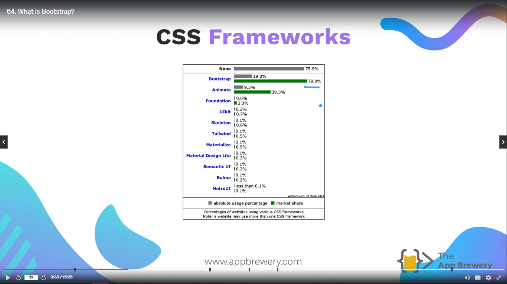
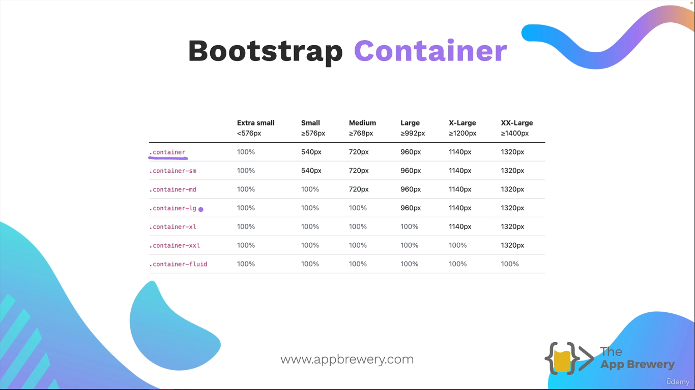
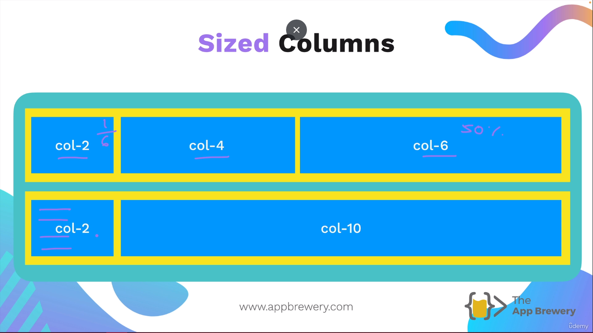
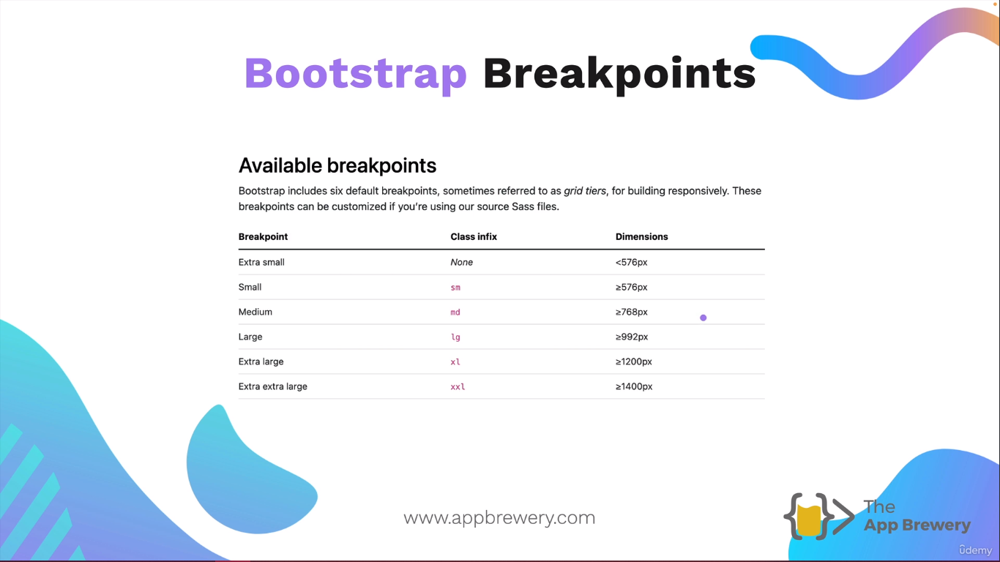
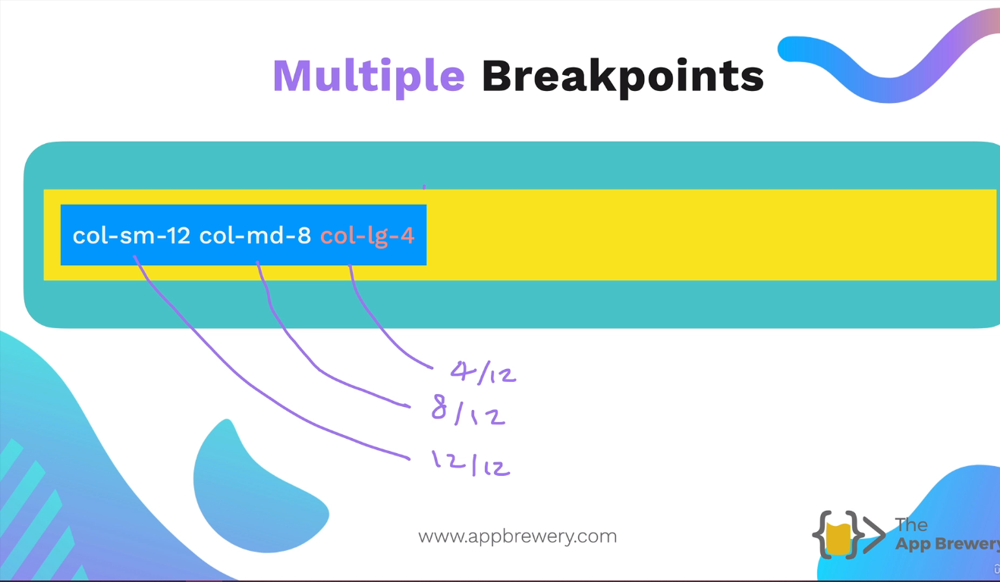
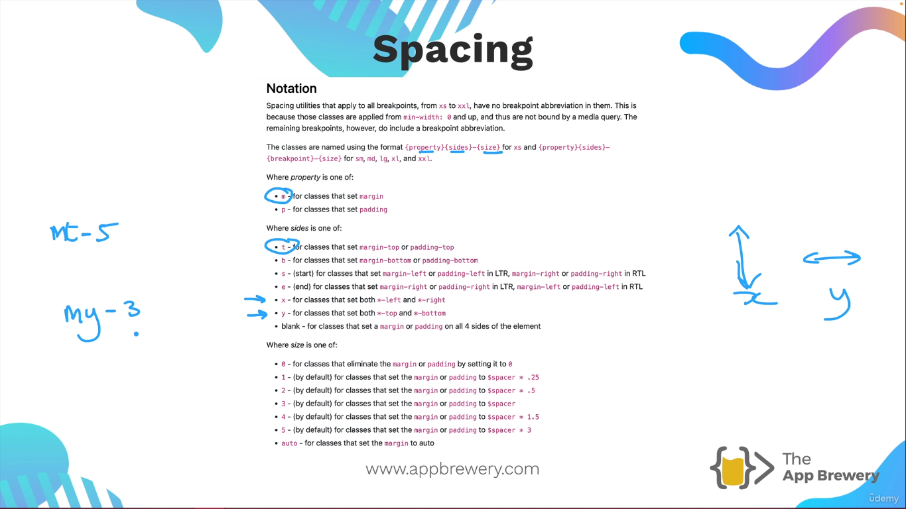

<h1 align="center" style="color: blue;">Bootstrap FrameWork - (External CSS FrameWork)</h1>

It is open source. And it has prewritten css for all the layouts you want to achieve.

**Pros** -

1. It is compatible for Mobile Devices and Desktop Browsers.
2. Easy and Fast to use. Tons of Components.
3. Consistent Styling.

**Downsides** -

1. Class Bloat. All styles have to be implemented like inline CSS. Make code look ugly.
2. Customization.

---

### 1. When to use Frameworks and when not..?

1. Mobile Responsive Websites. When you want fast making websites. Use Bootstrap Framework.
2. When you are making a simple or complex websites and have to regularly change in that, then it is not proper way to use Bootstrap Framework.

### What is a viewport?

A viewport represents the area in computer graphics being currently viewed. In web
browser terms, it is generally the same as the browser window, excluding the UI, menu bar, etc.
That is the part of the document you are viewing.

Contain Premade CSS Files and Components.

Example -

```html
<ul class="">
  <li>
    <button class="">Home</button>
    <!-- Here the button looks Normal and not fancy
    according to not standards -->
  </li>
</ul>

After Applying Bootstrap -

<ul class="nav nav-pills">
  <li>
    <button class="nav-link active rounded-5">Home</button>
    <!--The button will
    look awesome after applying bootstrap css and it's class to the element tag.-->
  </li>
</ul>
```



### How to use Bootstrap?

Inclue via CDN (content Delivery Network).

**CDN** - A content delivery network or content distribution network is a geographically distributed network of proxy servers and their data centers. The goal is to
provide high availability and performance by distributing the service spatially relative to
end users. For bootstrap it will find the location of the user and on basis of that It will provide the content to load which
is near to the server so that it can loaded fast and easily.

Example of how to use CDN To enable bootstrap -

```html
<head>
  <link href="https://cdn.jsdeliver.net/npm/bootstrap@5.3.-alphi...." />
</head>
```

**(Min) bootstrap.min.css**

Min is the file location which is on the internet which is so jumbled which make human to read is impossible. But it load fast on the browser because it has no spaces, and it will load easily where you want to apply.

> If you have custom css file like

```css
<link rel="stylesheet" href="./.style.css">
```

> Then you must include this file below the link that you have uploaded for Bootstrap.
>
> If you do not do so then you custom css file will override the bootstrap link.

## Bootstrap Layout

Understanding the **12 column** Bootstrap layout system.
Bootstrap Help in **Auto Fit**

### Syntax of Bootstrap Layout -

```html
<div class="container">
  <div class="row">
    <div class="col">Hello</div>
  </div>
</div>
```

Bootstrap Container is **Responsive**.


### Example -

1. .container,
2. .container-sm
3. .container.md
4. .container-lg
5. .container-xl
6. .container-xxl
7. container-fluid

**_.container-fluid - On all screen size we want to reach from edge to edge in width._**
(it says in all the screen size(whether it is mobile or tv) the container width should be 100% of the viewport size.)



Let's say we divide the container into **12** respective size. Then we will decide which item will use 2 spaces
2nd item will use 4 spaces and 3rd item will use 6 spaces, depending on what user will like.

Example -

```html
<div class="container">
  <div class="row">
    <div class="col-2">Hello</div>
    <div class="col-4">Hello</div>
    <div class="col-6">Hello</div>
  </div>
</div>
```

## Bootstrap Breakpoints -

These breakpoints have been made according to the screen sizes.


| BreakPoint        | Devices | Breakpoint-width((refering to width of the viewport(the height and width of the screen that you are viewing your website or app))) |
| ----------------- | ------- | ---------------------------------------------------------------------------------------------------------------------------------- |
| sm                | Mobile  | >= 576px                                                                                                                           |
| md                | tablets | >=768px                                                                                                                            |
| large             | laptop  | >=992px                                                                                                                            |
| extra large       | Desktop | >=1200px                                                                                                                           |
| extra extra large | TV      | >=1400px                                                                                                                           |

---

## Multiple Breakpoints -



**[Bootstrap Layout Exercise](https://appbrewery.github.io/bootstrap-layout/)**

```html
<div class="container">
  <div class="row">
    <div class="col">Hello</div>
    <!-- Mean the item that are inside the row, inside the container.-->
  </div>
</div>
```

> **Note**
>
> So how this 12 column layout work?
>
> When you have many items inside a particular row. It will try to **auto fit** all the items inside that particular row.
>
> (Let's say your container is divided into 12 parts. If let's say you use **col-2** for the first item. Then this **col-2** will suggest that this item
> will take 2 columns for this item. **col-4** will take 4 and **col-6** will take 6 and so on...)

## BootStrap Breakpoints -

Bootstrap includes six default breakpoints, sometimes referred to as grid tiers, for building website responsively. These breakpoints can be customized
if you're using our souce Sass Files.

### Example -

> For multiple breakpoints
>
> "col-sm-12 col-md-8 col-lg-4". Means if screen is small, then the item will take 12/12 or 100% of the viewport width
>
> If screen is medium, then the item will take 8/12 of the viewport width.
>
> If screen is large, then the item will take 4/12 of the viewport width.

[Boostrap Layout Exercies](https://appbrewery.github.io/bootstrap-layout/) for bootstrap layout exercise.

**_To know the breakpoint in respective webpage. Go to chrome or brave tools and then navigate to device-tool-bar. There you can see the dimension of the particular viewport size. This will be really helpful in defining the breakpoint whether it is xl, xxl, or md, lg, sm or extra small._**

## BootStrap Components

### Common used Components -

1. Button -

Syntax -

```html
<button type="button" class="btn btn-primary">Primary</button>
<button type="button" class="btn btn-secondary">Secondary</button>
<button type="button" class="btn btn-success">Success</button>
<button type="button" class="btn btn-danger">Danger</button>
<button type="button" class="btn btn-warning">Warning</button>
<button type="button" class="btn btn-info">Info</button>
<button type="button" class="btn btn-light">Light</button>
<button type="button" class="btn btn-dark">Dark</button>
<button type="button" class="btn btn-link">Link</button>
```

2. Spacing

   

   (For defining margin and padding in short form)

Example -

i. mb-5 ("m" means margin, "b" means bottom, and "5" means how much you have to provide the margin from bottom or size of 5)

3. Dark-Mode:

Refer Bootstrap themes (Dark)

**For more info, refer too [BOOTSTRAP](https://getbootstrap.com/) for docs, layouts etc.**
