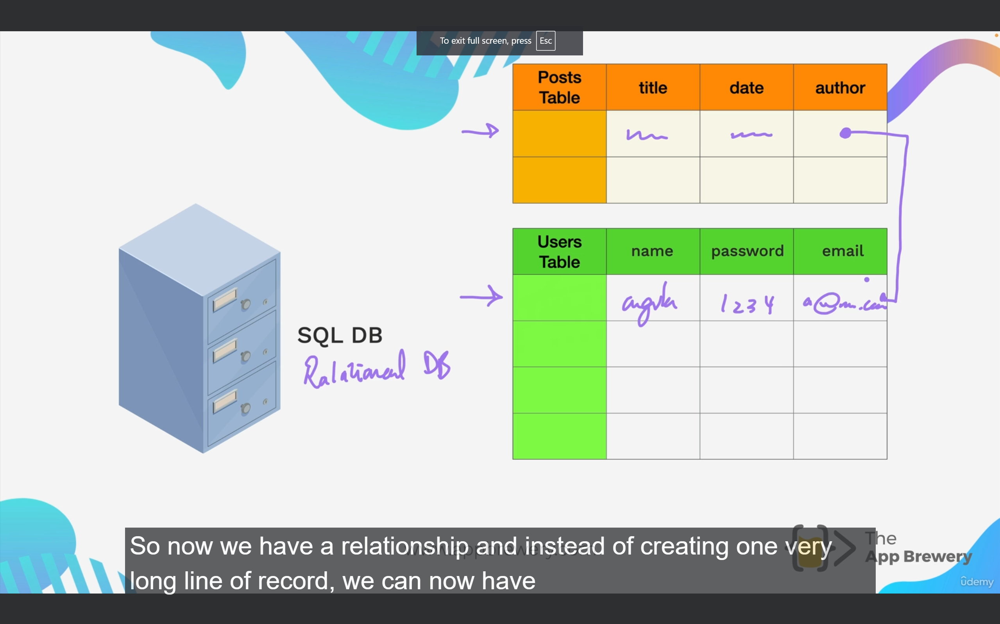

<h1 style="color:blue;" align="center">Database</h1>

## Where did my data go?

An in the last module, when we were building Blog Api, when we try to store the data in **var** variable, after restarting the server through **nodemon index.js** the data that was stored is completely wiped out and return to it's original state. It means that your data is stored in temporary memory and it's only valid as long as your server state doesn't get refreshed.

So how can we persist our data?

We need a data storage. What we need is essentially a form of data storage that prevents our variable which are held in temporary memory to go vanished.

## Databases

> Types of databases
>
> 1. SQL(Structured Query Language) Database
> 2. NoSQL Database

## SQL (Structured Query Language)

Structurely the data is stored in the form of **_tables_**.

Example -
Let's say you create a website and you need to keep track of users data, so you will create a table for users information. You will store probably their name, password, email and so on.

Once you have created columns, then you can populate them line by line by adding new records in your rows.

> **NOTE:**
>
> One of the greatest things about SQL type databases is their ability to form relationships, and this is why you'll hear another name for this type of database is a **Relational Database**.



In this above image, you can see that we have a relationship between two tables. We have person name, password and email information in one table and he/she created a blog which has a title, date and author.

Exmaple - Oracle Database, Microsoft Sql (Not open source)

**Another type of sql databases are - Postgres, MySql, Sqllite etc.** (Open source)

## NoSQL Databases

Let's say you create a data in the form of JSON or javascript object, one of the greatest things about NOsql is that you're able to change the structure of data afterwards without having to change the entire database.

```json
user: {
  name: "Angela",
  password: 123,
  email: a@email.com,
}
```

For only this particular user I want to provide it with extra field -

```json
user: {
  name: "Angela",
  password: 123,
  email: a@email.com,
  faveFood: "noodles"
}
```

**_ We can modify our data on the fly, and this is what gives Nosql database their flexibility. They are not obliged to hold to the original structure of the table that was created at the time when you decided to build a users table._**

Example -
Since Nosql is flexible, it means that as your product grows and you think of new things that you want to add to your storage, you can do very flexibly.

### Advantage of using NOsql over SQL -

1. The sql language is probably not the most intuitive and requires learning, whereas Nosql uses things such as key/value pairs as shown above or document models where you store everything in a single document just like **JSON. So it basically use to make things easier.**

2. The other big idea, as I mentioned, is flexibility and moving away from this strict schema. So having to anticipate and plan your data ahead of time.

3. And the other thing that they really want to address is scalability. So for your data to be able to scale horizontally and vertically. So vertically means having more records, and horizontally means having more fields.

```json
user: {
  name: "Angela",
  password: 123,
  email: a@email.com,
  faveFood: "noodles",
  greet: "hello World"
}
```

You can add as many fields horizontally in nosql, just as easy as it is to add in json.

Example of Nosql databases -

MongoDB(Organization), Redis(Open Source) and DynamoDB(Organization - Amazon).

Disadvantages of NoSql -

With over time Nosql is not so great and sql just because of one things which is relationships among tables. For large infrastructures which are using nosql are facing common issues like consistency and scalability. But in case of our sql, we are able to join tables, being able to query efficiently actually vastly increases the speed of databases access.

In addition, having the structure, being able to plan your database, plan your relationships ahead of time, and having consistency that you can rely on, turns out, is really good for maintaining good code quality. So it means that your're not querying for somethings and then suddenly get back somethings you don't expect because, "Oh we were able to dynamically add fields and change the structure."
