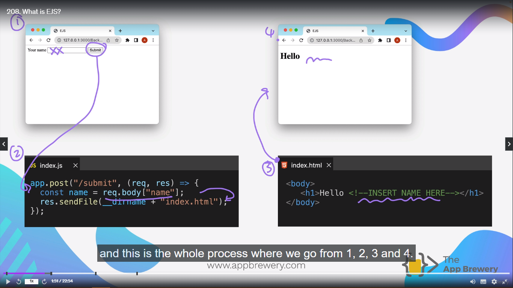
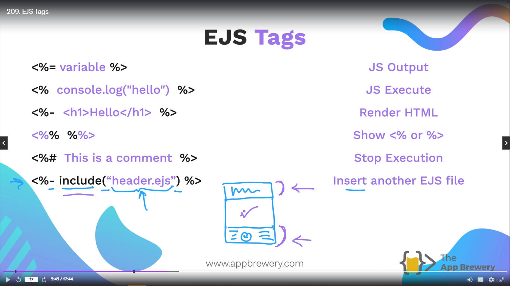
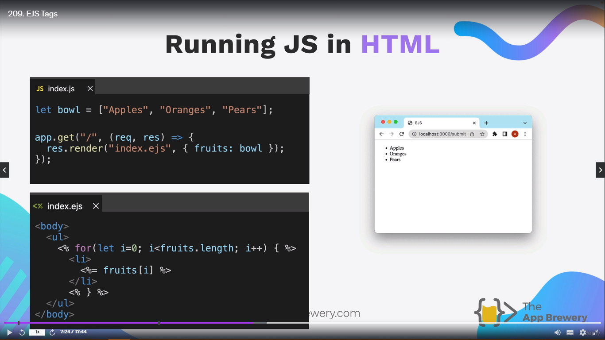
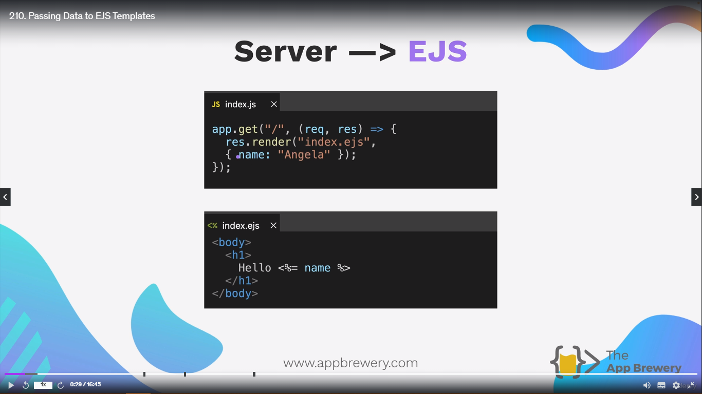
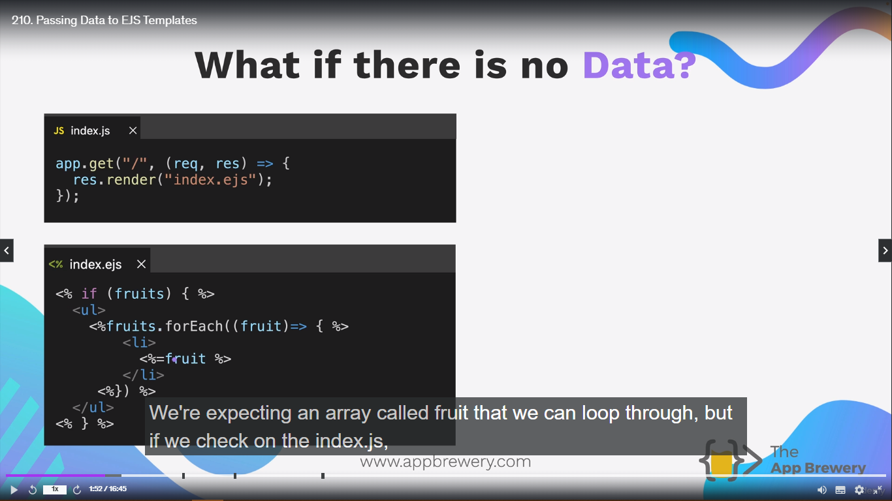
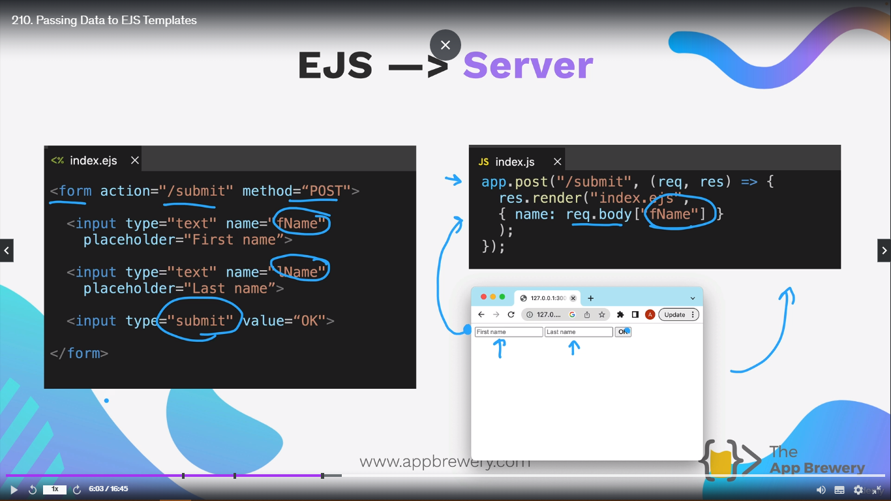

<h1 align="center" style="color: blue;">EJS</h1>

## What is Embedded Javascript or EJS or Why do we need EJS and why it is necessary to embed Javascript into our HTML files?

If we have a HTML Website where we have a form with an input, if we want to type something into that input, then it can be recieved in our index.js via the **POST** route and we can use body parser to tap into what was entered into that particular input. The input in the form has an attribute **name** that's set to "name", and ideally what we're trying to do is we're trying to allow a user to put their name in here so that we can re-render the website and then greet them. So whatever go in the input tag which is hopefully your name, then it will be re-rendered over into **h1** tag. When you hit **submit** button, it hits are **POST** route in our server and we recieve that value by the **req.body**. And then somehow we want to be able to send this information to a HTML file and insert it in there. And then once we've inserted that into the HTML File, maybe in **h1** then we can render this entire index.html file in our browser and it's should say, "Hello something or other".



**_Now the main question is, how do we pass something from our server to be rendered in a HTML File?_**
And that is done using **_templating_**.

Why do we need this complex process of templating?
Instead we can send the h1 tag like

```js
app.post("/submit", (req, res) => {
  const name = req.body["name"];
  res.send(`<h1>Hello ${name}</h1>`);
});
```

This works good if the situation is simple as something like above the code, then we send the "h1" tag like this.
But let's say if we want to send a complex code like this that it has link to the google fonts, css or something like -

```js
app.post("/submit", (req, res) => {
  const name = req.body["name"];
  res.send(`<head><meta></meta></head>
  <title>Angela Yu</title>`);
  // and so on
});
```

And if we write all the index.html inside the javascript the code become clutered and is not a good method of sending everything of index.html through javascript. We have something called **seperation of concern**. Where we keeps the functionality separate for everything. Like index.html and css for styling and structure while javascript for functionality. Now as to write both html and css inside the javascript and sending all the things will distrupt the principle of **seperation of concern**. Also we want to separate **front-end** and **back-end**.

This **seperation of concerns** is really important as you start buidling bigger and complex projects.

**_In order to this, the seperation of concerns, we need to user something called Templating Language_**.

Example - handlebars, pug, Jinja(Python), Twig(PHP), EJS(Javascript).

It's like having a little bit of javascript code inside the index.html file and the extension will end with **_.ejs_** file extension.


**_And esentially all we've got is just HTML but with bits of Javascript enclosed inside a special syntax._**. We are essentially able to generate a website, and the items can be generated from our server side, sent to our EJS file and rendered onto screen like this.

```js
app.post("/submit", (req, res) => {
  const name = req.body["name"];
  res.sendFile(__dirname + "index.html");
});
```

> The only problem with res.sendFile is that it is only able to send only **static** files or so files that don't change.
>
> A template such as one using EJS does change because we're having to insert things into it. So instead of using res.send or res.sendFile we can use **_res.render_**.

Res.render - It allows us to do is to firstly specify the file that we want to render on screen, and then we can add Javascript object to pass over some properties and it's a key/value pair.

```js
app.post("/submit", (req, res) => {
  res.render("index.ejs", {
    name: req.body["nam"],
  });
});
```

```html
<body>
  <h1>Hello <%= name%></h1>
</body>
```

For making **EJS** files you have to put all the files inside the folders called **_views_** for able to use EJS templates.

> **NOTE:**
>
> A command line hack -
>
> **_mkdir views; touch index.js views/index.ejs_**

```js
import express from "express";
// import { dirname } from "path";
// import { fileURLToPath } from "url";
// const __dirname = dirname(fileURLToPath(import.meta.url));

const app = express();
const port = 3000;

app.get("/", (req, res) => {
  // const d = new Date();
  // const answer = d.getDay();
  // console.log(answer);
  // if (answer >= 1 || answer <= 5) {
  //     res.send("Hey! It's weekday, it's time to work hard!");
  // } else if (answer === 0 || answer === 6) {
  //     res.send("Hey! It's the weeknd, it's time to have fun!");
  // }
  const today = new Date("July 7, 2024 11:13:00");
  const day = today.getDay();
  console.log(day);

  let type = "a weekday";
  let adv = "it's time to work hard";

  if (day === 0 || day === 6) {
    type = "the weeknd";
    adv = "it's time to have some fun";
  }

  res.render("index.ejs", {
    dayType: type,
    advice: adv,
  });
});

app.listen(port, () => {
  console.log(`Listening to port ${port}`);
});
```

```html
<!DOCTYPE html>
<html lang="en">
  <head>
    <meta charset="UTF-8" />
    <meta name="viewport" content="width=device-width, initial-scale=1.0" />
    <title>Weekday Warrior</title>
  </head>
  <body>
    <h1>Hey it's <%= dayType %>, <%= advice %></h1>
  </body>
</html>
```

Basically this exercise where we demonstrate how ejs works, is that we pass data from our server over to our template file, the ejs file using javascript object using different properties and then the EJS file has to live in views folders and we use the EJS syntax to pick up those properties and insert them into our HTML.

## EJS Syntax

```html
<%= %>, <% %>, <%- %>, <%% %%>, <%# %>, <%- include("FILE NAME")%>
```

1. <%= %> - Starting and closing of ejs (<% %>). The mid section will be interpreted as javascript but in addtion, there will be an **output** that's going to be put into the HTML and EJS file. We can insert a variable and that variable could be a name.

Syntax -

```html
<%= "variable" %>
```

If we run the the javascript file and ejs tag is rendered in the browser, you will see the name show up on the website. So it is an interpreted javascript with an output.

2. <% %> - If we just have the pure EJS tag, then this is executable javascript code. Writing javascript inside html.

Example -

```html
<% console.log("hello") %>
```

3. <%- %> - It should be interpreted as HTML. Send HTMl to ejs file and that will rendered and interpreted in the browser.

Example -

```html
<%-
<h1>Hello World</h1>
%>
```

4. <%% %%> - We can actually show the EJS tag on the browser.

Example -

```html
<%% %%>
```

5. <%# %> - Comment. Stop Execution.

Example -

```html
<%# This is a comment %>
```

6. <%- include(File name) %> - Insert another EJS file

Example -

```html
<%- include(header.ejs)%>
```

Lets' say we create a website where we have same header and footer in multiple pages. So instead of writing header and footer again and again. We can simple write the header and footer file inside another ejs file and just only include the file, where you are currently changing the body of the page.



### Example of using Javascript and Ejs

```js
let bowl = ["Apples", "Oranges", "Pears"];

app.get("/", (req, res) => {
  res.render("index.ejs", { fruits: bowl });
});
```

```html
<body>
  <ul>
    <% for (let i = 0; i < fruits.length; i++) { %>
    <li><%= fruits[i] %></li>
    <%}%>
  </ul>
</body>
```



## Challenge

Exercise 4.1

Each for loop syntax -

```js
items.forEach((fruit) => {
  fruit;
});
```

```html
<%items.forEach((fruit) => { %>
<li><%= fruit %></li>
<% }); %>
```

```c
#include <bits/stdc++.h>

using namespace std;

int main() {
    int n;
    cin >> n;
    vector<int> x(n);
    for (int i = 0; i < x.size(); i++) {
        cin >> x[i];
    }
    cout << endl;
    for (auto i: x) {
        cout << i << " ";
    }
    return 0;
}
```

## Passing Data to EJS Templates (Passing Data from server to client and client to server)

Server To EJS -



### What if there is no Data?



In above image, we can see, we are not passing any data to render in ejs. Let's say for some reason like data corrupted, runtime error in javascript file, we are not able to pass the data to ejs file.

**_In javascript, we can prevent by using some check of if statements or when running the code, the compiler will check for error. But in ejs it is not possible._**

### Why this error happens in EJS?

It is because it is not checking for the scope of the variabe, whether it is defined or not. It just simply use the **key** to render the **value** that is associated with **key** and displays on the screen. But in our case, we are not passing any key-value pairs to the EJS, so there is no checking of scope inside EJS as like in javscript. That's why it produces and error, and crashes everything.

**_EJS doesn't scope the variable. EJS doesn't actually check to see, well, does this actually exist before it tries to use it. Instead it tries to use it and, "Oh, there's nothing"._**

To prevent such type of things -

We use variable called **locals**.

**_Locals - It is basically a way to access all of the variables that get sent over with a res.render. This local variable always exist, like a global variable defined and that means we can always use it to check for the existence of variable that are passed over to EJS, and if this in fact does exist, then we can use it as we would normally. This is important to check when you are passing data from the server side to EJS._**

Now you can also manually set res.locals and you can set it equal to some piece of data.

```js
res.locals = { data: 42 };
```

Now this local variable is what can be accessed in the rendered EJS file.

### Data Sending from EJS to Server.



We are passing piece of data from EJS to server. When you entered you name in the input section. It get's stored in name attribute of input tag. Then through body parser middleware, We can acces the piece of data.

## Partials and Layouts

We haven't taken account of front-end. How to combine front-end with backend and so on. We haven't include styling and all the great things we learned about the frontend, all of the adding stylesheets, adding bootstrap, flexbox and so on.

To include header or navbar code into index.ejs will create our program more clustered and difficult to understand.

And it will be difficult to send all this code through **res.send**. And let's say some body are dynamic and needs to be changed but some code remain same through all the website like **navbar** and **footer**.

Now let's say we have made a multiple page website. Now include the code of **header** and **footer** again and again in ejs file will make our program lengthy and difficult to understand. Instead we can create a seperate **header.ejs** files and **footer.ejs** files and directly include in our index.ejs file.

```html
<%- include("partials/header.ejs") %>
<body></body>
<%- include("partials/footer.ejs") %>
```

Now the things which will remain static throughout our website like **images**, **favicons**, **stylesheets** will be include inside the folder name **_public_**. And in order to tell Express that this is where our static files are located, we can use the middleware

```js
app.use(express.static("public"));
```

**_What this code is doing, it is simply using middleware from express to located the folder public and grab all the static files inside the public folder. This code remains at the top level of our project_**

If my public folder was inside src/public/images and src/public/styles. Then we would write -

```js
app.use(express.static("/src/public"));
```

Now we have decide where would be our public folder through **express.static** middleware.
If we create a stylesheet, href attribute will be relative to the location of the public folder. In this case, notice how the path to my stylesheets is **styles/layout.css**. Now when we run our index.js file it will go to the index.ejs or whatever the file is and through express the full path to access the stylesheet will become **_public/styles/layout.css_**.

### Why we need to tell Express the location of public folder and to set these files as static?

It is because the file path works in node and Express for dynamic pages is a little bit different from static pages.

Example -
If on our website, we have some navigation links, just as I've got here, It's going to different pages in my website and it's rendering different EJS files.
But the way that I'm getting these files location, is actually by sending **GET** request to a paritcular route. These dynamic parts of our website are routed and their location are generated dynamically like **localhost:3000/**, **localhost:3000/about**, **localhost:3000/contact**, whereas static parts of our website, such as where our images are or where our CSS lives, doens't need to be generated dynamically and so we can simply specify the static folder that they live in.

And the ejs file which will be common in all our webpages will remain inside folder called **partials** which will inside the folder **views**.
