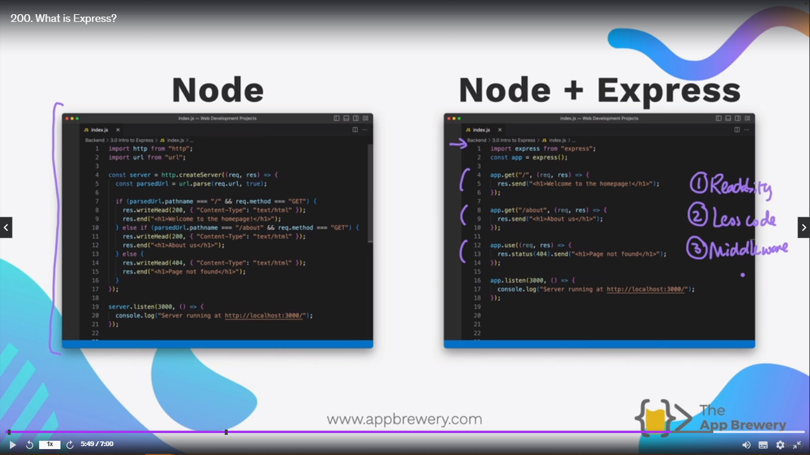
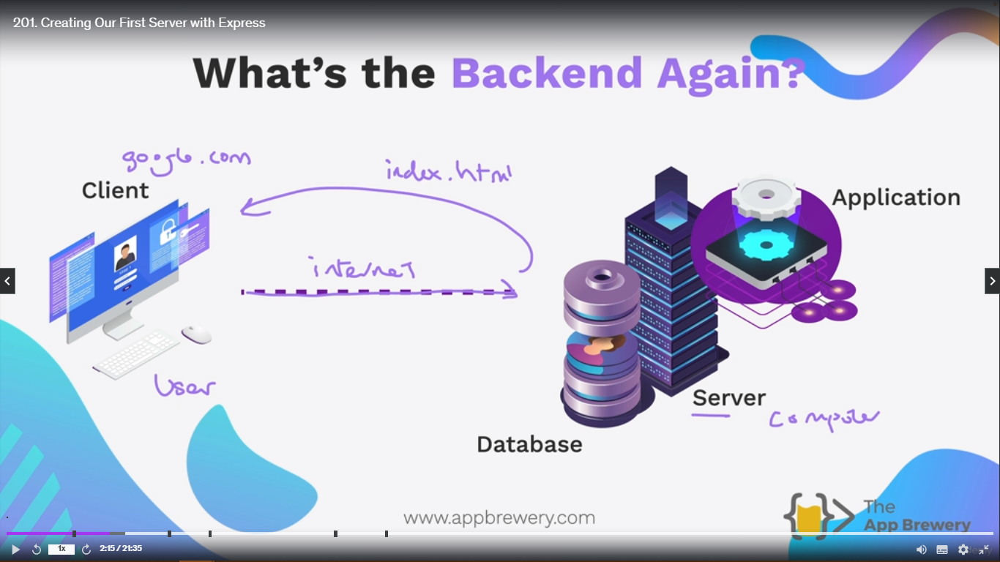
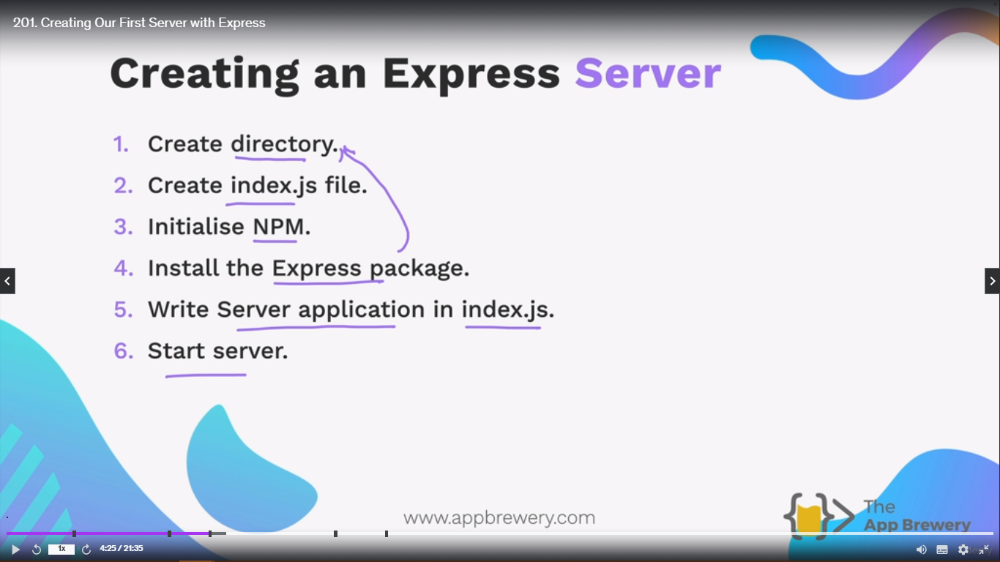
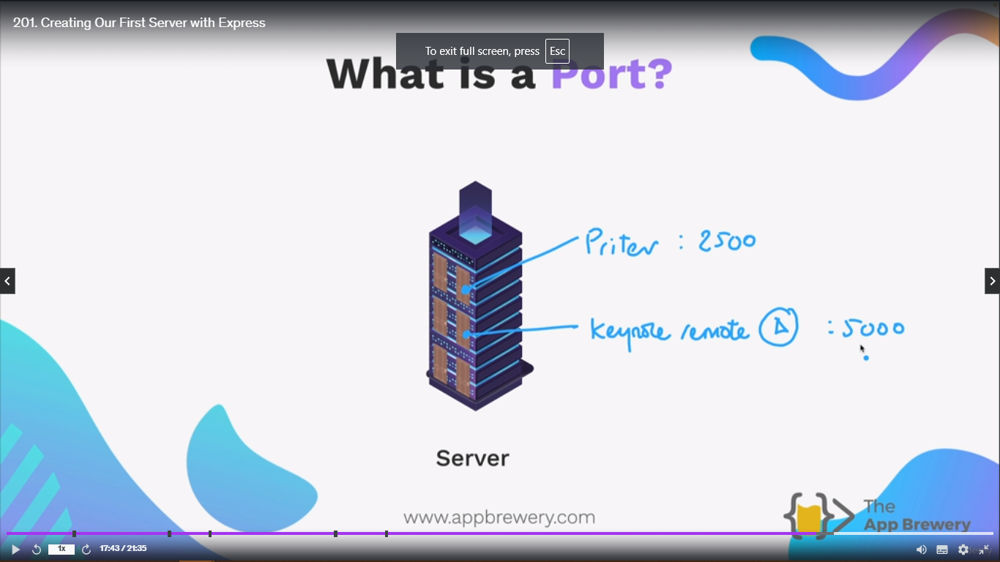
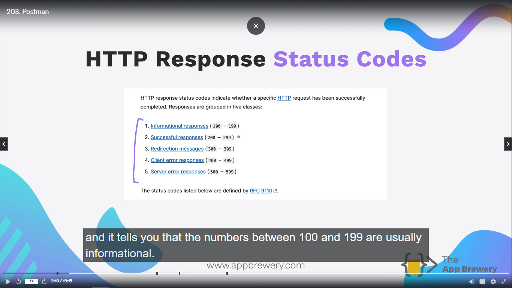
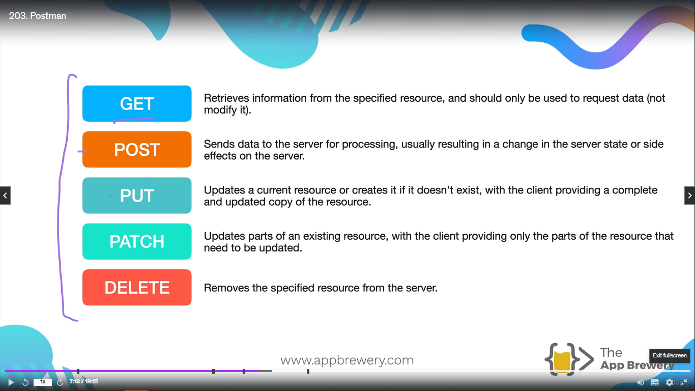
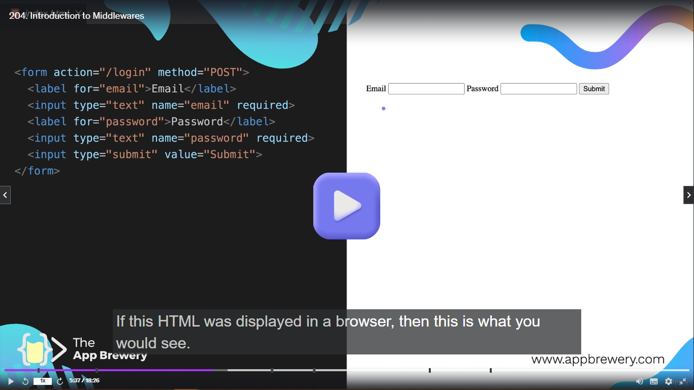
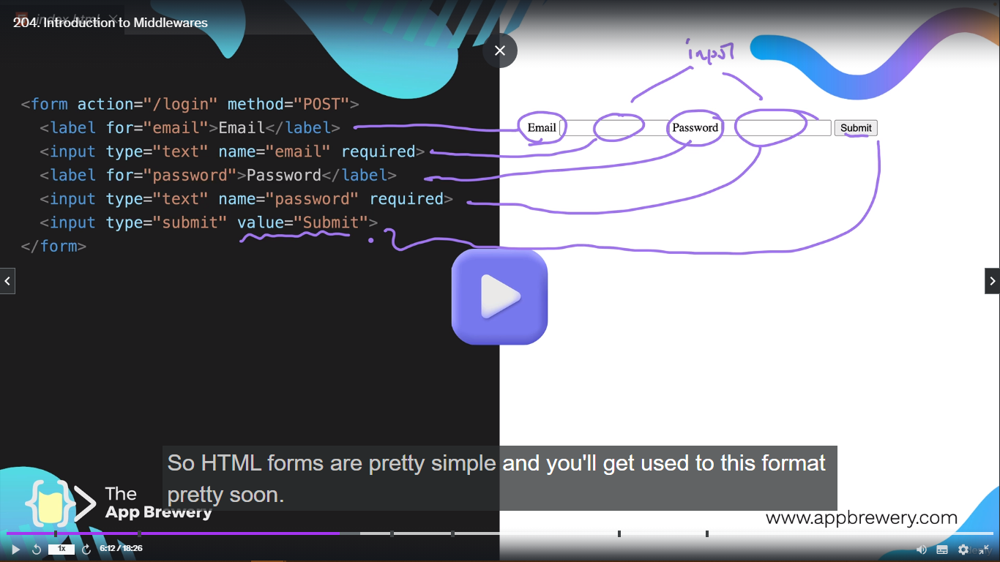

<h1 align="center" style="color: blue;">ExpressJS (Express Framework)</h1>

We can use many languages for Back-End -
Java, Ruby, php, C#, Python, Javascript

For each languages we have framework associated with it.

### Why would you need a Frameworks anyways?

Example of **Mayonnaise**. Instead of making your own mayonnaise, buy the store maked mayonnaise. Same as two write the code from scratch, instead use the framework for the particular technology, which make the task easy.

Frameworks provide pre-built components and structures that can be used to build an application without the need for us to write every single line of code from scratch.

We have many frameworks like -

1. Ruby on Rails
2. ASP.Net
3. Flask
4. Django
5. Laravel
6. Springboot.

On the other hand NodeJS is not a Framework, instead it is a **runtime environment** which is used to run Javascript on your local computer instead of just limited to website.

For Javascript Framework - Express is the most popular.

**_So basically we combine both NodeJS and Express Framework to built Back-End of a website using Javascript._**

### Why do we need Express if have node for everything?




In the above image, it shows how difficult is to write the backend just using Node. Readability is over, Code is lengthy and is difficult to understand. On the other hand, Express with node make it super clean and easy to read.

Advantages of using Express with Node -

1. Readability
2. Less Code
3. MiddleWare (Just like lego, to basically insert the features which you want to choose for your website).

## Creating our First Express Server

### What is backend Again?

For creating our backend Application, we have following things to make our backend work.

1. Server - It is basically a powerfull computer, which is live for 24/7 and is able to listen to the request send by the user looking for a particular resource, like HTML, CSS or Javascript.
2. That server has some **_Application_** which is written in code. Application is running on the server computer like index.js file.
3. Database - For complex website to store company data, or user data.



Terminologies used in Web Development

1. Client Side - Front-End
2. Server Side - Back-End

### Creating an Express Server



```js
1. import express from "express";
2. const app = express();
const port = 3000;

3. app.listen(port, function () {
  console.log(`Server running on port ${port}`);
});
```

1. We are importing express module from express pacakge.
2. const - This keyword declares a constant variable. It's value can never be changed in a website later on. This prevent consistency and prevents accidental modifications.
   app - The name of the variable.
   express() - This is a function call that creates a new Express Application instance. The express() function is typically imported from the express module using **require** or **import**.

> So this code is the basic foundation of creating a express application.

3. There is **listen** function which is currently taking 2 parameters.
   First is the **_port number_** - It is the location of our server where we are going listening for request from the client side.
   Second is **_callback function_** - When our app is listening on port **3000** and everything is done, then it's goint to trigger this callback function.

Now you can simply run the file index.js file like **node index.js**. Node is not there in our program, but Express is doing all the heavy lifting for our website, by having node initialized in our project.

> Now when we type **_localhost:3000_** on browser, it will return me **Cannot GET/** output because we haven't write anything. But it is listening and returning me something through our local server.

### What is localhost?

Localhost is simply, when we don't have a server on the internet and instead, we want to host our server locally. Making our own computer, the server of our website's backend.

> **NOTE:**
>
> Longer version of localhost -
>
> **https://localhost:3000**

### What is a port?

The port is the kind of equivalent to a bunch of doors on our server computer, and each of these doors have an address.

And in our case, when we set up our server, we specified that the door or that port we want to be listening on is port 3000. Then it's going to look onto our own computer and it's going to try and find the door that is number 3000, and through that door, it can reach inside to our computer and it can find application that's listening and ready to respond to any requests, such as sending over some HTML, CSS or Javascript in order to serve our website.

> Why we have so many ports?
>
> Because each port is identified by a unique number, then different services or different application or different hardware can tap into particular port and this way we can have multiple services running through the same computer without then interfering with each other so that each one can be listening on a particular port.



> **NOTE:**
>
> To know which port are listening right now?
>
> **_netstat -ano | findstr "LISTENING"_** on windows
>
> **_sudo lsof -i -P -n | grep LISTEN_** on Mac/Linux
>
> "|" **PIPE** symbol.

To stop the server from running just type **Ctrl + c**

## HTTP Requests

### Learn the language to make requests to your server.

**_HTTP_** - Hyper Text Transfer Protocol

To communicate between each other - we need language like English, and this protocol is called **_Thought Transfer Protocol_**

For computer to talk across internet, they need the **_Hypertext Transfer Protocol_**, different language which allows them to talk to each other.

Terminologies -

When we make an HTTP Request we come across 5 words -

**1. GET** - Request a resource from the server, this could be a HTML website, text or data from database or get a resource from server.

**2. POST** - You are sending a resource to the server. This could be information, form like sign up, email and password are send through POST request.

**3. PUT** - Replace a resource, or update something completely.

**4. PATCH** - Patch up a resource.

**5. DELETE** - Delete the resource from server or database. But it is a request from client side to the server side to delete something.

> **PUT** and **PATCH** are kind of similar, but they have a different meaning. Understand this example with help of Amazon. Let's say I ordereed a bicycle which is broken. In terms of **PUT** I want to replace the complete bicycle. In terms of **PATCH** I want to replace only the part which is broken.

```js
1. app.get("/", function (req, res) {
  res.send("Hello, World");
});
```

1. Here we are calling the **get** function from express module. We are basically passing two parameters.
   "/" - User is trying to get something from home page. "/" basically means HOMEPAGE.
   Example - localhost:3000/ or localhost:3000. You can have both expression and both are same and true. But basically it is trying to get request from the homepage. In Anonymous Function there are two parameters -
   1. Req - Request (What kind of request is coming).
   2. Res - Respond (What kind of respond should be given to the coming request).
      In my case Request is coming to the homepage and I am responding with (Hello World).

> **NOTE:**
>
> Let's say you are running your project on locahost:3000 and then you open the second project and then you open it and run the project. This time **error 👎** will show which is saying **port: 3000 is already in use**.
>
> You can solve it by 2 ways-
>
> 1. Is by killing the server of 1 project through **Ctrl+c** command.
> 2. [To kill a port](https://dev.to/sylwiavargas/how-to-properly-close-a-port-2p36).

```js
app.get("/", (req, res) => {
  console.log(req.rawHeaders);
});
```

req.rawHeaders - The raw request/response headers list exactly as they were received. The keys and values are in the same list. It is _not_ a
list of tuples. So, the even-numbered offsets are key values, and the
odd-numbered offsets are the associated values.

Example - "localhost:3000", "google-chrome", "Windows" etc.

> So what is happening?
>
> When I request my homepage at this particular path and I hit enter to go that location, my browser sends the request to my server(node) and because my server is running and listening and it knows how to handle that GET request, it seeeing me the text.

### Endpoints ("/")

"/" is the endpoint.
Example - "localhost:3000/"

Let's say I want to send a letter to a particular person living in Europe or Africa. The endpoint should look like "/Europe", "/Africa".

```js
app.get("/", (req, res) => {
  res.send("<h1>Home Page</h1>");
});
```

// Here "/" is targeting the root or homepage and getting me html tag which is h1 and it is visible on screen.

// Similarly we can change the end point to point to other page and get the request through their.

Example -

```js
app.get("/", (req, res) => {
  res.send("<h1>Home Page</h1>");
});
app.get("/About", (req, res) => {
  res.send("<h1>About Me</h1>");
});
```

// Here the endpoint is "/About" or "localhost:3000/About" and when I send this request to the server and it looks through index.js and get the request from the server and is showing me on the screen and html tag which is saying "About Me".

For more information [Requst_and_Respond](./Request_Respond.md).

> **NOTE:**
>
> Consider server1 (computer)(house), node as a main person of the server1 and browser (server 2), a person is HTTP, Now when the main person starts the node, it open the ports 3000 for listening and "localhost:3000" start displaying on house1 then the person tells to type localhost:3000 on browser. Now browser tell the person or HTTP to get the respond from the endpoint. Endpoint will be different, in our case these are three different rooms, It can go the first endpoint which let's say is the hall room and respond anything which is inside that hall room. This is a simple demonstration of how server, http, node works.

## POSTMAN

Response from HTTP can be html, css, text or response like "404 Response".

404 - HTTP Standard Response Status code.



For more information, refer [HTTP Response Status code](https://developer.mozilla.org/docs/Web/HTTP/Status)

> The most important we are talking about is **200** response.
>
> The request succedded, The result of "success" depends on the HTTP method. Get, Head, Put or post, Trace.

Other are **201**, **404**.

To check which status code is written when you type any URL. Go to **_chrome developer tool, then head Network section, and check the box which is (preserved log) and the (all) tag is selected. Now when you type any url it will show the response status code_**.

| HTTP Return codes cheat sheet | Value | Example       |
| ----------------------------- | ----- | ------------- |
| Hold On                       | 1\*\* | like 101, 102 |
| Here you go                   | 2\*\* | like 201, 200 |
| Go Away                       | 3\*\* | like 301, 300 |
| You Fucked UP                 | 4\*\* | like 404, 405 |
| I fucked UP                   | 5\*\* | like 501, 502 |



Post - HTML form is send through POST request to server and when it is done it is done with 200 or 201 response status code.

> Create a backend without frontend for checking the code is good or not. Here come the tool **_POSTMAN_**.

```js
import express from "express";
const app = express();
const port = 3000;

app.get("/", (req, res) => {
  console.log(req.rawHeaders);
  res.send("<h1>Hello</h1>");
});

app.get("/About", (req, res) => {
  res.send("<h1>About Me</h1><p>My name is Raja Vanwani</p>");
});

app.get("/Contact", (req, res) => {
  res.send("<h1>Contact Me</h1><p>Phone: +91:999999999</p>");
});

app.post("/register", (req, res) => {
  res.sendStatus(201);
});
app.put("/user/raja", (req, res) => {
  res.sendStatus(201);
});

app.patch("/user/raja", (req, res) => {
  res.sendStatus(201);
});

app.delete("/user/raja", (req, res) => {
  res.sendStatus(201);
});

app.listen(port, function () {
  console.log(`Server running on port ${port}.`);
});
```

We have simplified other HTTP request like post, put, patch, delete. The first parameter is endpoint and next parameter is a callback function which having two parameters (request, respond). The request is Post, put, patch, delete and respond is the http response status code, which is **res.sendStatus(201)**.

## Express MiddleWare

### What is MiddleWare?

It is kind of something that sits between the raw request that comes in. When the request comes to the server and pass before it get processed by **routes handlers** such as Get, post,put, delete, patch etc. there is something in between which is **MiddleWare** that can work with These request before they reach to it's final destination which is **route handlers**.

### What kind of things can MiddleWare do?

**1. Pre-Process** - It pre-process the request, Let's say request has come which is assign of multiple handlers, MiddleWare act as intermediate stage and can actually go ahead and change the aspects of the request or perform various functions on that request before it goes to it's final routing.

**2. Logging** - MiddleWare is used for logging the request. Like, How long did it take the request to come through?, What type of request Get, put, post etc.?, what is the status of request begin handled?.

**3. Authentication** - Before we let the request through to our back-end handlers, we can see if that request actually came from a client that is authorized to make that request, say if somebody wants to go and change Facebook database to handbook, so it checks whether the request is allowed to the user or not.

**4. Errors** - We can identify them and handle those errors before they go through to the handlers as well.

> So a number of functions can be peformed basically before we allow the request through. A really commonly **_Body-Parser_**.
>
> **Body-Parser** - It is a body parsing middleware. It can look at the request bodies before your handlers actually access them. This basically gives our request a new property called the body property. And very commonly this is used to handle **_form_** data.

HTML Forms Example -

```html
<form action="/login" method="POST">
  <label for="email">Email</label>
  <input type="text" name="Email" required />
  <label for="password">Password</label>
  <input type="text" name="password" required />
  <input type="submit" value="Submit" />
</form>
```

**FORM** - It has two attributes action and method. Action is where you have to do the action which is the **endpoint**. Method is which request handler you are targeting.
**LABLE** - It is simply a place where we label the next input, because an input is usually just a box. It doens'nt really tell the user what you expect to go in there. Pair of label and input.
**INPUT** - Three attribute **_type_**, **_name_** and **_required_**. Type consist of many things like radio-buttons, checkboxes, box and here my type is "Text". Name is used to label the data that goes into this input. Let's say I enter my email, then this email is the value which is associated with a key which is "name". The third attribute is **_required_** which tells that this input cannot be submitted untill there is a piece of data that is added into it.
**INPUT 2 ** - It has two attribute which **_type_** and **_value_**. Type is here "submit" which is actually a submit button. and the value assign to is "Submit". Means that what the button name is. It will be anything like "Ok" and in this case it is "Submit".





### What are public folders?

The folders in which files will not change like index.html, css or images. The files which remain static will go into this folder.

### How to determine the path of the folder when your server is not locally hosted and it is in the cloud.

```js
import { dirname } from "path";
import { fileURLToPath } from "url";
const __dirname = dirname(fileURLToPath(import.meta.url));

app.get("/", (req, res) => {
  res.sendFile(__dirname + "/public/index.html");
});
```

Now when hosted how it will determine the full path. This is the full path - "Windows:User_Name:/mnt/e/Development/My_First_Website_Again/ExpressJS/3.4Middlware/public/index.html". Now it will just determine this path from just three lines of codes.

"import {dirname} from "path"" - Basically we are importing this module from node.
"import {fileURLToPath} from "url""a - This is also import from node.
"const **dirname = dirname(fileURLToPath(import.meta.url)); - This module is converting my path which is "Windows:User_Name:/mnt/e/Development/My_First_Website_Again/ExpressJS/3.4Middlware" and storing it inside the constant variable which is "**dirname".

> Why it is converting the path?
>
> **_This is because when your application is locally hosted then this path is correct. But when it is hosted to the cloud, then how it will recognize this path. Then in this case the above three line will convert your address dynamically and store it in the variable called \_\_dirname. And this is able to find the location of the file when hosted on cloud._**

"app.get("/", (req, res) => {
res.sendFile(\__dirname + "/public/index.html");
}); - This respond has a new function which sendFile instead of send which we are using before. Now this get request has come and we are responding it with by sending the file from a particular. Here \*\*\_concatenation_** is going on (**dirname + "/public/index.html") Now this full path will be send which **_\_\_dirname/public/index.html_**.

> When I Run this following lines of code and I console.log it. It will give me this address which is generated by the above 3 lines of codes.
> "/mnt/e/Development/My_First_Website_Again/ExpressJS/3.4 Middleware/public/index.html"

### Important Code

```js
import { dirname } from "path";
import { fileURLToPath } from "url";
const __dirname = dirname(fileURLToPath(import.meta.url));
import bodyParser from "body-parser";

app.use(bodyParser.urlencoded({ extended: true })); // bodyparser code. Run before the handlers.
app.get("/", (req, res) => {
  console.log(__dirname + "/public/index.html");
  res.sendFile(__dirname + "/public/index.html");
});
```

### Full Explanation of the above code.

1. **Import Statements:**

import { dirname } from "path";: This line imports the dirname function from the built-in Node.js path module. This function extracts the directory path from a given file path.

import { fileURLToPath } from "url";: This line imports the fileURLToPath function from the built-in Node.js url module. This function is used in modern Node.js environments (like using Node.js with bundlers) to convert a file URL to a file system path.
const \*\*dirname = dirname(fileURLToPath(import.meta.url));: Here's a breakdown:
import.meta.url: This special variable holds the URL of the current module (the JavaScript file you're running).

fileURLToPath(import.meta.url): This converts the module URL to a file system path.
dirname(...): This extracts the directory path from the converted file path using the imported dirname function.

The final line assigns this directory path to the constant \*\*dirname. This is a common practice to reference the directory where your current script resides.

2. **Body Parser Middleware (Optional):**

import bodyParser from "body-parser";: This line imports the body-parser middleware from a third-party library (likely installed using npm or yarn).

app.use(bodyParser.urlencoded({ extended: true }));: This line assumes you have already created an Express app instance (app). Here, it's using the app.use method to register the body-parser middleware. This middleware helps parse incoming request bodies from forms or other sources that use URL-encoded data.

The configuration { extended: true } allows the body-parser to handle complex data structures like nested objects in the request body.

3. Serving Static Files (Assuming app.use is for the BodyParser):

app.get("/", (req, res) => { ... });: This line defines a route handler for the root path (/). It will be executed whenever a user makes a GET request to the root URL (e.g., http://localhost:3000/).

Inside the function:
console.log(\*\*dirname + "/public/index.html");: This line logs the path to the index.html file within the public directory, assuming the public directory is located in the same directory as your script.

res.sendFile(\*\*dirname + "/public/index.html");: This line uses the res.sendFile method to send the content of the index.html file as the response to the user's request. This assumes you have an index.html file in your public directory that contains your website's main content.
