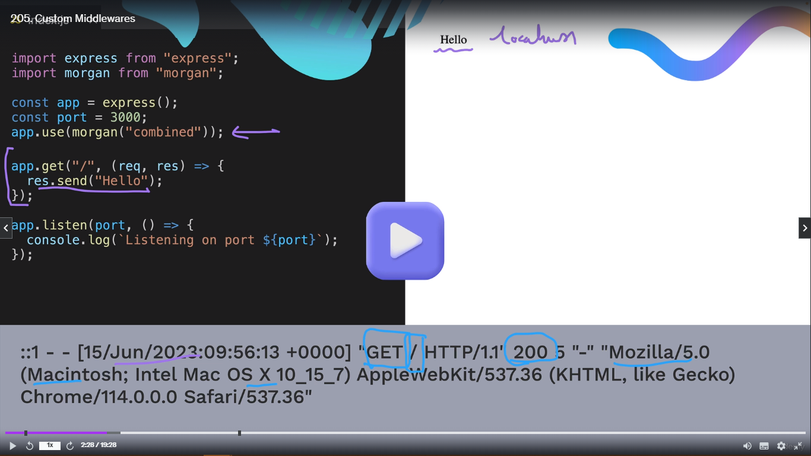

<h1 align="center" style="color: blue;">ExpressJS</h1>

## Custom MiddleWare

In section **What kind of things can MiddleWare do?** we have discussed different type of things that middleWare can do which is pre-processing, logging, authentication, and error handling.

**_Body-parser belongs to pre-processing category_**.

For logging MiddleWare - **_Morgan_**.

```js
import express from "express";
immport morgan from "morgan";

const app = express();
const port = 3000;
app.use(morgan("combined"));

app.get("/", (req, res) => {
  res.send("Hello");
});
app.listen(port, function() {
  console.log(`Listening on port ${port}`);
});
```

> **Let's say we have made the request by going to the URL localhost:3000. Then when the request was made to the server and in respond "Hello" came. But also behind the scenes this middleware function **app.use(morgan("combined"))** has triggered before it even gets to the app.get() handler and we get and output in our console which has the date and time of the request it has the type of request, url, status code, and also the address of the status from where it is come.**



## Building our own MiddleWare.

```js
import express from "express";

const app = express();
const port = 3000;

app.use(function logger(req, res, next) {
  console.log(
    "Request Method is " + req.method + " and Request URL is " + req.url,
  );
  next();
  console.log(`Request Method is ${req.method} and Request URL is ${req.url}`);
});

app.get("/", (req, res) => {
  res.send("Hello Raja Vanwani");
});

app.listen(port, () => {
  console.log(`Listening on port ${port}`);
});
```

> **NOTE:**
>
> **next()** is necessary. As it was not written it will not execute the handlers part and it will be forever stuck and not respond will be made.
