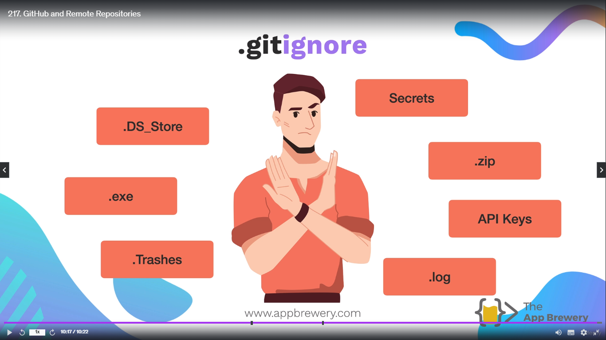
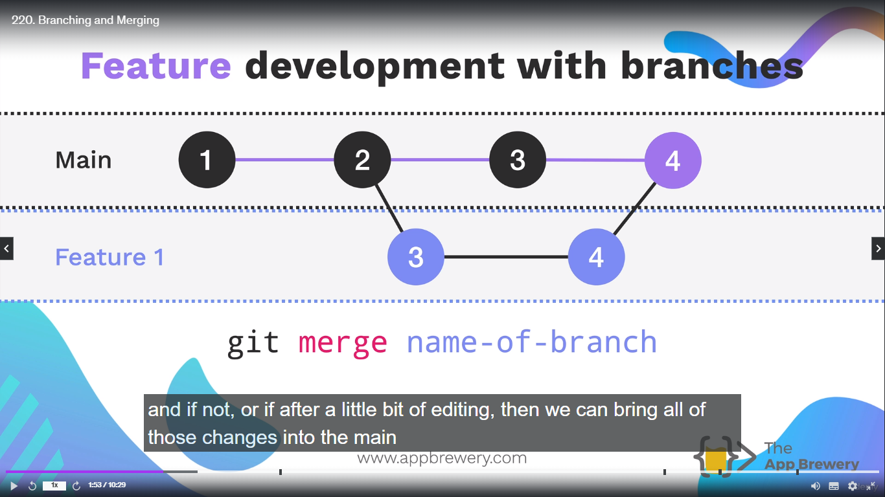

<h1 align="center" style="color: blue;">Github and Git</h1>

## Github and Git

### What is version control?

Let's say I create a new code file and I write some lines of code in it. Now, I decide to put it under version control using **Git**.
Let's say I call this **save point** Number 1. Now this is my first version.

Later on I progress, and I write some more lines of codes, and at this point I decided to make another save point. And I called this my second version.

Further down the line, I screw up my entire code file and it's irrerperable, and I get to the point where I have to remove all the code and it cannot be fixed. Now this code is not fixable, so just I want to roll back to my **last save point**. I can do that using Git.

You can either compare your current code file, so that the current mess that you've made against a previous version.

So version control, is basically a checkpoint. You can simple roll back to your previous save code if your current code is not fixable. And it doesn't have to be that was immediately previous, you can go as far back or as far forwards as you like as long as you know which version you want.


## Version control using git and the command line

To initialise git -

```
git init
```

To see the changes in your file, you need to add your file to what's called **Staging Area**. And basically it is an intermediate place where you can pick and choose which files inside your working directory that you want to commit to see the changes.

To see what is inside your **Staging Area** -

```
git status
```

The output will be

```
On branch master

No commits yet

Untracked files:
  (use "git add <file>..." to include in what will be committed)
        chapter1.txt

nothing added to commit but untracked files present (use "git add" to track)
```

It is showing which files are untracked and which are tracked.
**_Basically it means which files are in working directory but it's not yet in the staging area._**

In order it to add it to staging area and to start tracking the changes in it, then we have to use command -

```
git add [filename]
```

Now after this our file **chapter1.txt** will be added in the staging area. Now when you hit **git status** it will show like -

```
On branch master

No commits yet

Changes to be committed:
  (use "git rm --cached <file>..." to unstage)
        new file:   chapter1.txt

```

**_Commit - It's something that helps you to keep track of what changes you have made in each commit. So when you create a new save point you want to be as explicit as possible about what changes were made between the last save point and this current save point._**

Now to **commit** the file -

```
git commit -m "Message" [filename]
```

> **NOTE:**
>
> Always try to write the message in **present** tense.

To see what commits you have made recently your before -

```
git log
```

Output will be like -

```
commit a4d8f6e01db5bf84c0a027936a67f9b1e21fa09e (HEAD -> master)
Author: vanwani2000 <rajavanwani2001@gmail.com>
Date:   Mon Jul 15 20:58:18 2024 +0530

    Initial Commit

```

> **NOTE:**
>
> If you want to add all the files to the staging area, you just need to type command **_git add ._**

**.** sign - means add all the files to the staging area from current working directory.

1. As seen from above image, First we initialise git to the current working directory to track all the change to the file.

2. Then we add our file to the staging area. This process is 3 step process. Why we can't simply just add all the files from our current working directory to the git repository. Why we need a staging area?

This is because, sometimes we dont' want to add some files to the staging area.

> So the staging area is a good place to try and figure out what are the things that you want Git to ignore and what are the things that you want to tracked...


Command to revert back or roll back to the last position in our local repository -

```
git checkout
```

Now, let's say I went to chapter3.txt and change the text inside it. And then save the file. Now, If I type **git status** - it will show the file that has been modified.

> Now to see what changes have been made from the previous version to latest version, we can simply write -

```
git diff [filename]
```

Example -

```
git diff chapter3.txt
```

Output will be -

```
diff --git a/chapter3.txt b/chapter3.txt
index b74c2e7..ae4671d 100644
--- a/chapter3.txt
+++ b/chapter3.txt
@@ -1 +1 @@
-It was the spring of hope, it was the winter of despair.
+adsf;ladsjfldsafja;ldsljf;lsdakksfja;dsjfk;lasjf;lksdajf;lkadsjfajds;lkfjsda;lkfjsda;lkk
```

First the line was - -It was the spring of hope, it was the winter of despair.

Now the line is - adsf;ladsjfldsafja;ldsljf;lsdakksfja;dsjfk;lasjf;lksdajf;lkadsjfajds;lkfjsda;lkfjsda;lkk.

Now, let's say I don't like this change, now to go back to previous version, just type -

```
git checkout [filename]
```

In our case -

```
git checkout chapter3.txt
```

It will revert the changes in the file to the previous version.

## Github and Remote Repositories

In above documentation, we were looking at local implemetations of using Git and Version control, now in this we will see how we make a **remote repository** and hosted on somebody else's server or somebody else computer by using Github.


To add the address of your remote or github repository -

```
git remote add <name> <url>
```

In our case -

```
git remote add origin [url_of_your_repo]
```

The repo addresss will be generated once you made a new repository.

Now to push your file from local repo to github repo, Simply t ype -

```
git push <remote name> <branch name>
```

In our case -

```
git push origin master
```

Main branch -


Before pushing main branch to Remote rep -


After pushing main branch to Remote Repo -


## GitIgnore

How to use .gitignore? Choose which files not to track.

Files which are to be ignored -




These are the files that are not to upload on github.

**OS_Generated_Files** - These are the files that are to do with your local settings or your user preferences. And there's a whole bunch of these types of utility files that you dont' really want another person to have to download and copy into their projecct folder if they're **cloning** or if they're **forking** your projects.

Common type of gitignore files -

1. DS_Store - These are basically a settings files that saves certain things like how you like your icons to be arranged in a particular project folder.

### How do we create a gitignore file?

```
touch .gitignore
```

Just type correctly **.gitignore**.

If let's say If we simply commit the file before adding the files which has to be ignored. It will commit all the file..

Output -

```
On branch master

No commits yet

Changes to be committed:
  (use "git rm --cached <file>..." to unstage)
        new file:   .DS_Store
        new file:   .gitignore
        new file:   file1.txt
        new file:   file2.txt
        new file:   file3.txt
        new file:   secrets.txt
```

I don't want to commit **.DS_Store** and **secrets.txt** file.

> **NOTE:**
>
> To remove or undo all the files from staging area

```
git rm --cached -r .
```

> -r flag - Recursive
>
> . = Everything inside the current working directory should be remove from the staging area.

### Tips and Rules for .gitignore files -

1. For comments - use "#" and then comment.

2. \*.txt - To ignore all the files with certain extension.
   Example - Let's say I want to ignore all the text files from my current directory.
   Simply type

```
*.txt
*.txt
```

Now when we stage, the files which I have mentioned inside .gitignore files will be ignored and not gone to staging area.

For more .gitignore templates - [.gitignore templates](https://github.com/github/gitignore).

From this you can see **Node.gitignore** file for the Exercise from .gitignore module.

## Git Clone

Git Clone - Cloning Or make a copy of a remote repository on github to pull it onto your local repo.

Command is -

```
git clone url
```

Example -

```
git clone https://github.com/acct/project_name.git
```

So once you've cloned a repo, you've essentially made a copy of it on your local working environment and allows you to stand on the shoulders of giants and contiue where they left off. Basically **_Build and existing code_**. So, you won't need to clone it again during regular development.

Why do you need clone?

It's basically so that you can have your own copy of a program that they wrote. Maybe you want to customize it to your own needs. Maybe the program needs to do something it currently doesn't do and you want to extend it's functionality. Or maybe you just found a bug and you want to fix it.

It allows you to leverage somebody else's open source code.
So they are putting there source code out onto the internet and you can simply make a copy of it and continue where they left off.

For a list of Free software network service and web applications which can be hosted on your own server [Awesome-SelfHosted](https://github.com/awesome-selfhosted/awesome-selfhosted)

Let's clone some actual repos from github and run them locally to see how the entire process works.

**To Read Other's People Code** -

One of the best ways to improve your programming skills is to read other people's code, to understand what their code is doing, and most importantly, try to modify it just a little bit at the beginning and maybe a lot more in the future, but it gives you a way to level up your skills set by building on top of somebody else's work. And open source code is a great way to get started.

For first time open source contribution, simple project from which you get your hand on the real world project - [Awesome-Simple-Open-Source-Project](https://github.com/MunGell/awesome-for-beginners).

## Branching and Merging

How to use branches to develop features and collaborate on a codebase.

Let's say if we had version 1 and 2, so two commits that were made to our local repo, and at this point, we realize that we want to maybe try out something different, maybe build a new feature, or just to mess around with some idea or concept. What we can do is instead of continuing to commit to the **main** branch that you see here, we can also create a side branch.

```
git branch [name-of-branch]
```

After the second commit, we create new branch and we start commiting to this new branch or this experimental branch. We add some features and write some code. Simultaneously, we can continue working on the main branch, putting all the essentials updates or bits of code that are maintaining our main project, **_but at same time we can continue to update and work on this experimental branch trying things out and commitint our experiments to this experimental branch._**

So now we have two branches that are parallel to each other and they can be developed Simultaneously.

If at some point in the future that we decide that experiment was really fruitful, and the feature that we built in it, was really really great and we'd like to **merge** it back to the main branch, then that can be done really easily as well as by simply placing a merge request in -

```
git merge [name-of-branch]
```

And we can bring all of those channges that we experimented with, that we messed around with, back to the main project and check to see if there's any conflict with the main branch code and if not, or if after a little bit of editing, then we can bring all of those changes into the main working branch.



And we can continue working from here onto to the next commit or we can make more branches.

**_And in practice, we can see multiple branches being worked on at the same time for any given large project._**

**_And the reason, is sometimes you are making new feature, and sometime fixing bugs,all of these things may break your main project, so you don't want to do it on the main branch. You only want to put it onto the main branch once you know that everything is working fine, and then you can bring your code to working copy ready for shipment and deployment_**


> **NOTE:**
>
> To get the list of all the branches

```
git branch

```

Output will be -

```
alien-plot
* master
```

> Here "\*" means current working branch.

To change from one branch to the other branch -

```
git checkout [name-of-branch]
```

In our case -

```
git checkout alien-plot

```

Another Alternative to switch branches instead of using checkout -

```
git switch [branch-name]
```

Output -

```
1. commit 0dec09987858852e8d5ef0d29a32499b3cc8c85b (HEAD -> master)
Author: vanwani2000 <rajavanwani2001@gmail.com>
Date:   Tue Jul 16 21:21:46 2024 +0530

    add chapter4.txt

2. commit 10f7ecec3f31dafca1c6814c79a086eab01a4485 (origin/master)
Author: vanwani2000 <rajavanwani2001@gmail.com>
Date:   Mon Jul 15 21:42:52 2024 +0530

    Second Commit

commit a4d8f6e01db5bf84c0a027936a67f9b1e21fa09e
Author: vanwani2000 <rajavanwani2001@gmail.com>
Date:   Mon Jul 15 20:58:18 2024 +0530

    Initial Commit

```

1. is the commit inside local repo
2. is the commit inside the remote repo or github repo. Because we haven't push the latest commit to the github repo.

After merging, we type "git log", output will be -

```
commit d8edf0916c91d301e6d76fb0b675a777352d7794 (HEAD -> master)
Merge: 0dec099 921e792
Author: vanwani2000 <rajavanwani2001@gmail.com>
Date:   Tue Jul 16 21:25:41 2024 +0530

    Merge branch 'alien-plot'

commit 0dec09987858852e8d5ef0d29a32499b3cc8c85b
Author: vanwani2000 <rajavanwani2001@gmail.com>
Date:   Tue Jul 16 21:21:46 2024 +0530

    add chapter4.txt

commit 921e792ef2b87caa04c214245212562d23bbc68c (alien-plot)
Author: vanwani2000 <rajavanwani2001@gmail.com>
Date:   Tue Jul 16 21:19:12 2024 +0530

    Modify chapter 1 and 2 to have an alien theme

commit 10f7ecec3f31dafca1c6814c79a086eab01a4485 (origin/master)
Author: vanwani2000 <rajavanwani2001@gmail.com>
Date:   Mon Jul 15 21:42:52 2024 +0530

    Second Commit

commit a4d8f6e01db5bf84c0a027936a67f9b1e21fa09e
Author: vanwani2000 <rajavanwani2001@gmail.com>
Date:   Mon Jul 15 20:58:18 2024 +0530

    Initial Commit

```

**_It will merge all the logs of both master and alien-plot branch with the merge commit log._**

## Forking and PULL Request

How to suggest code changes and contribute to an open source project.
Best way to start working with the team of programmers.
