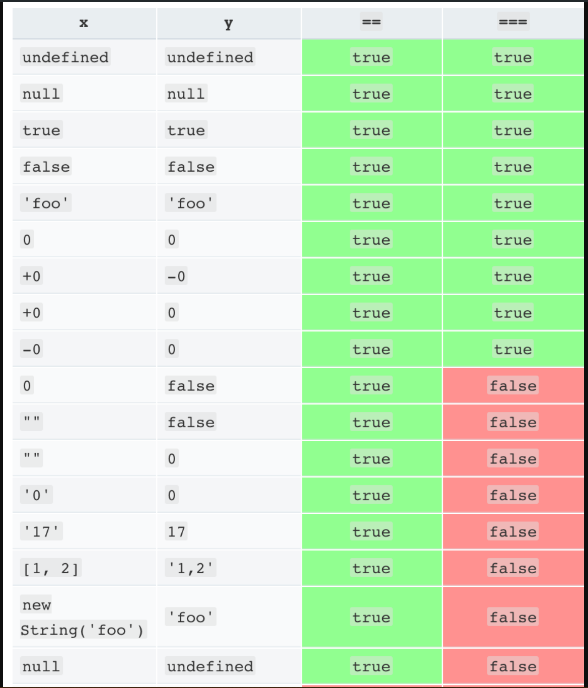
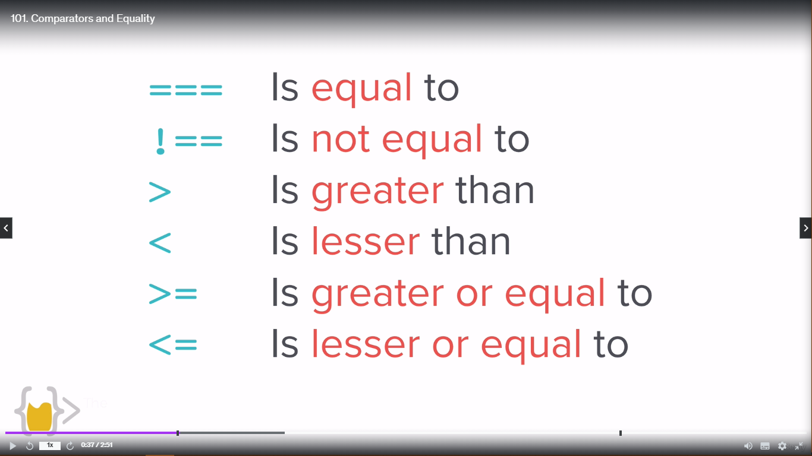
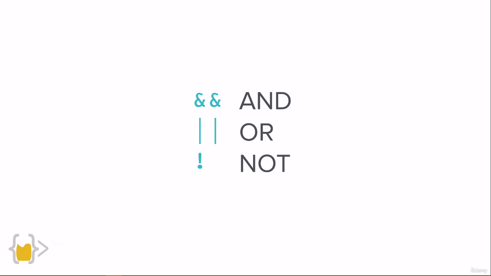
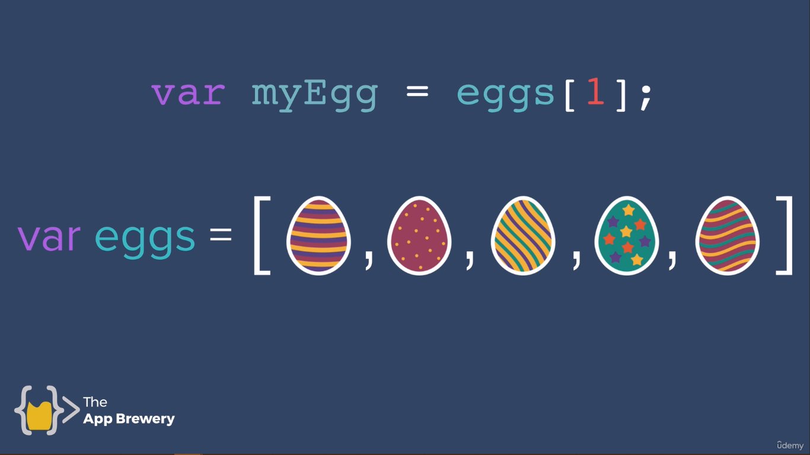
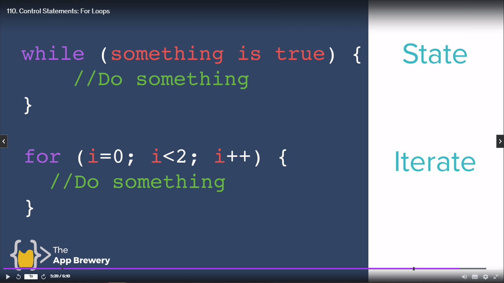
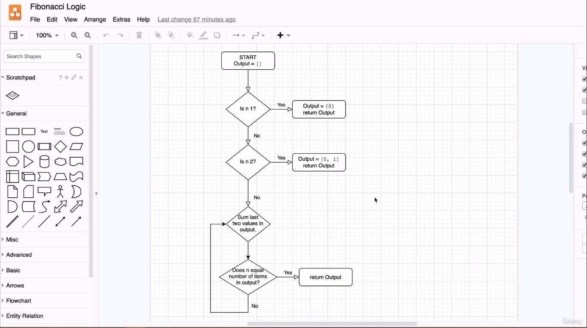

<h1 align="center" style="color: blue;">Intermediate Javascript</h1>

## Random Number Generation -

When you are creating a game, there is much need of ramdom numbers to be generated.There the random function in **Math** Library of Javascript comes handy.
The random numbers that is generated is **16 Decimal Places** number.
The random number starts from **0** and ends at **0.9999999999999999**.

> Math.random() -
>
> The Math.random() function returns a floating-point, pseudo-random numbers in the range from 0 inclusive up to but not including 1 - which you can then scale to your desired range. This random number is generated by **Random Number Algorithm** and it cannot be chosen or reset by the user. This is also called **Pseudo-Random** number generator, because it creates the random number on the basis of what I desired.

Example -

```js
var n = Math.random(); // Output - 0.3647382746318429
// Here n will be different every time we run the code, but it can be from the starting to end point describe above. It cannot reach 1.
```

Question -

Random Number Generation in Dice.

```js
var n = Math.random();
n = n * 6;
// n = Math.floor(n); // Here the answer will come from 0 to 5
// To get the answer from 1 to 6, we will have to simple add just 1.
n = Math.floor(n) + 1;
console.log(n);
```

Question -

Creating a Love Calculator.

```js
var first_name = prompt();
var second_name = prompt();

var n = Math.random();
n = Math.floor(n * 100) + 1; // To not include 0 to 99. But from 1 to 100.
console.log(
  "The " +
    first_name +
    " and " +
    second_name +
    " has this much " +
    n +
    " % of crush from both side.",
);
```

---

## Control Statement - Using If-Else

Also known as **Control-Flow** as it is controlling the flow of program.
**If** statement is right then it will have a flow structure but **If** statement is wrong then it will have control-structure and it will execute the **Else** part.

```js
if (track == "clear") {
  goStraigh();
} else {
  turnRight();
}
```

Question -

Use If-Else statement in the Love Calculator.

```js
prompt("What is your name?");
prompt("What is your name?");

var loveScore = Math.random() * 100;
loveScore = Math.floor(loveScore) + 1; // 1 - 100

// In c++ we use "==" for equality but in Javascript we use "===" three equal signs for comparision
if (loveScore === 100) {
  alert(
    "Your love score  is " +
      loveScore +
      "%" +
      " You love each other like Kanye love Kanye",
  );
} else {
  alert("Your love score  is " + loveScore + "%");
}
```

If we want to check the love message from particular range to range. We will use comparision operators. **>**, **<**, **>=**, **<=**, **!=**.

```js
prompt("What is your name?");
prompt("What is your name?");

var loveScore = Math.random() * 100;
loveScore = Math.floor(loveScore) + 1; // 1 - 100

//Here greater sign is used to check whether our lovescore comes in range above 70.
if (loveScore > 70) {
  alert(
    "Your love score  is " +
      loveScore +
      "%" +
      " You love each other like Kanye love Kanye",
  );
} else {
  alert("Your love score  is " + loveScore + "%");
}
```

Refer [Difference Between "==" and "==="](https://stackoverflow.com/questions/359494/which-equals-operator-vs-should-be-used-in-javascript-comparisons).



---

## Comparators and Equality -

Two compare between two values.



Difference between **==** and **===\***. Above Link to refer to.

Example of **==** -

```js
var a = 1; // int datatype
var b = "1"; // string datatype.
if (a === b) {
  console.log("yes");
} else {
  console.log("no");
}
// In this case answer is "no".
```

Example of **===** -

```js
var a = 1;
var b = "1";
if (a == b) {
  console.log("yes");
} else {
  console.log("no");
}
// In this case answer is "yes".
```

> Notes
>
> In case of **===** it is checking both equality and data-types. But in case of **==** it is only checking equality between the given values.

---

## Combining Comparators -

These are the three operators used to combine the ranges in IF-Else statement.
| Value1 | Value2 | AND |
| --------------- | --------------- | --------------- |
| 1 | 1 | 1 |
|1 | 0 |0 |
| 0|1 |0 |
| 0|0 |0 |

| Value1 | Value2 | OR  |
| ------ | ------ | --- |
| 1      | 1      | 1   |
| 1      | 0      | 1   |
| 0      | 1      | 1   |
| 0      | 0      | 0   |

| Value | NOT |
| ----- | --- |
| 1     | 0   |
| 0     | 1   |



Question -

Give the particular message range from above 30 and upto 70.

```js
prompt("What is your name?");
prompt("What is your name?");

var loveScore = Math.random() * 100;
loveScore = Math.floor(loveScore) + 1; // 1 - 100

//Here greater sign is used to check whether our lovescore comes in range above 70.
if (loveScore > 70) {
  alert(
    "Your love score  is " +
      loveScore +
      "%" +
      " You love each other like Kanye love Kanye",
  );
}

if (loveScore > 30 && loveScore <= 70) {
  alert("Your love score  is " + loveScore + "%");
}

if (loveScore <= 30) {
  alert("Your love score is " + loveScore "%" + "Yo go together like oil and water.")
}
```

Question -

> BMI Calculator Advanced (IF/ELSE)
> Previously, we've created a function that is able to calculate the BMI. But once we get a result, we will want to tell the user what the number means.
>
> Write a function that outputs (returns) a different message depending on the BMI.
>
> 1. BMI <18.5, the output should be: "Your BMI is <bmi>, so you are underweight."
> 2. BMI 18.5-24.9, the output should be "Your BMI is <bmi>, so you have a normal weight."
> 3. BMI >24.9, the output should be "Your BMI is <bmi>, so you are overweight."
>    The message MUST be returned as an output from your function. You should NOT NEED to use alert, prompt or console.log in this challenge.
>
> IMPORTANT
>
> The message wording has to match precisely for the code to pass the validation. Including punctuation and capitalisation.

```js
function bmiCalculator(weight, height) {
  var bmi = weight / Math.pow(height, 2);

  if (bmi < 18.5) {
    return "Your BMI is " + bmi + ", so you are underweight.";
  } else if (bmi > 18.5 && bmi <= 24.9) {
    return "Your BMI is " + bmi + ", so you have a normal weight.";
  } else if (bmi > 24.9) {
    return "Your BMI is " + bmi + ", so you are overweight.";
  }
}
var weight = prompt();
var height = prompt();
var answer = bmiCalculator(weight, height);
console.log(answer);
```

Question -

> ### Leap Year Challenge Exercise.
>
> ### 💪This is a Difficult Challenge 💪
>
> Write a program that works out whether if a given year is a leap year. A normal year has 365 days, leap years have 366, with an extra day in February. The reason why we have leap years is really fascinating, this video goes into more detail.
>
> This is how to work out whether if a particular year is a leap year:
>
> A year is a leap year if it is evenly divisible by 4 ;
> except if that year is also evenly divisible by 100;
> unless that year is also evenly divisible by 400.
>
> e.g. Is the year 2000 a leap year?:
>
> 2000 ÷ 4 = 500 (Leap)
>
> 2000 ÷ 100 = 20 (Not Leap)
>
> 2000 ÷ 400 = 5 (Leap!)
>
> So the year 2000 is a leap year.
>
> But the year 2100 is not a leap year because:
>
> 2100 ÷ 4 = 525 (Leap)
>
> 2100 ÷ 100 = 21 (Not Leap)
>
> 2100 ÷ 400 = 5.25 (Not Leap)
>
> **Warning**
>
> Your output should match the Example Output format exactly, even the positions of the commas and full stops.
>
> Example Input 1
>
> 2400
>
> Example Output 1
>
> Leap year.
>
> Example Input 2
>
> 1989
>
> Example Output 2
>
> Not leap year.

```js
function isLeap(year) {
  var dividedBy4 = year % 4;
  var dividedBy100 = year % 100;
  var dividedBy400 = year % 400;
  console.log(dividedBy4);
  console.log(dividedBy100);
  console.log(dividedBy400);
  if (dividedBy4 === 0 && (dividedBy100 !== 0 || dividedBy400 === 0)) {
    console.log("Leap year.");
  } else {
    console.log("Not leap year.");
  }
}
var year = prompt();
isLeap(year);
```

---

## Collections: Working with Javascript Arrays.

Storing single data or data values in variables.

```js
var a = "Angela";
var b = 123;
```

But if want to store the collection of relative data or datatypes in a variable. Here the **Arrays** comes handy.

> **Array**
>
> Collection of items or data which are related to each other.


The solution of this answer will be egg which is **red** in color.

```js
var totalEggs = eggs.length;
var eggs = [1, 2, 3, 4, 5];
console.log(totalEggs);
```

Guest-List

1st Method -

```js
var guestList = ["Angela", "Jack", "Pam", "James", "Lara", "Jason"];
var yourName = prompt("What is your name?");
if (guestList.includes(yourName)) {
  alert("You are Welcome!!!");
} else {
  alert("Sorry, Next time!!!");
}
```

2nd Method -

```js
function getName(yourName, guestList) {
  var ans = false;
  // let variable are only valid till this loop. There existence over when this loop will over.
  for (let i = 0; i < total; i++) {
    if (yourName === guestList[i]) {
      ans = true;
      break;
    } else {
      ans = false;
    }
  }
  return ans;
}

var yourName = prompt("What is your name?");
var guestList = ["Angela", "Jack", "Pam", "James", "Lara", "Jason"];
var ans = getName(yourName, guestList);
if (ans == true) {
  alert("You are Welcome!!!");
} else {
  alert("Sorry, Next time!!!");
}
```

## Adding Elements in Array -

**array_name.push** - This is used to push the values at the **_end_** of the user defined array. Let's say -

```js
var a = []; // Empty Array/
a.push(1); // Push the value 1 at position 0
console.log(a); // It will return [1];
a.push(2); // Push the value 2 at position 1;
console.log(a); // It will return [1, 2];
```

**array_name.pop** -- This is used to pop out the value or delete the value from the end in user defined array.

```js
var a = []; // Empty Array/
a.push(1); // Push the value 1 at position 0
console.log(a); // It will return [1];
a.push(2); // Push the value 2 at position 1;
console.log(a); // It will return [1, 2];
a.pop(); // It will pop the value 2 which is present at then end of the array.
console.log(a); // It will return [1];
```

Question -

> Write a program that prints the numbers from 1 to 100. But for multiples of three print "Fizz" instead of the number and for the multiples of five print "Buzz". For numbers which are multiples of both three and five print "FizzBuzz".

Method 1:

```js
var output = [];
var count = 1;
function fizzBuzz() {
  if (count % 3 == 0 && count % 5 == 0) {
    output.push("FizzBuzz");
  } else if (count % 3 == 0) {
    output.push("fizz");
  } else if (count % 5 == 0) {
    output.push("Buzz");
  } else {
    output.push(count);
  }
  count++;
  console.log(output);
}
```

Method 2:

```js
for (let i = 1; i <= 100; i++) {
  if (i % 3 === 0 && i % 5 == 0) {
    console.log(i + "FizzBuzz");
    continue;
  }
  if (i % 3 === 0) {
    console.log(i + "Fizz");
    continue;
  }
  if (i % 5 === 0) {
    console.log(i + "Buzz");
    continue;
  }
}
```

Important Question -

> ### Who's Buying Lunch? Code Challenge.
>
> You are going to write a function which will select a random name from a list of names. The person selected will have to pay for everybody's food bill.
>
> Important:
>
> The output should e returned from the function and you do not need alert, prompt or console.log. The output should match the example output exactly, including capitalisation and punctuation.
>
> Example Input:
>
> ["Angela", "Ben", "Jenny", "Michael", "Chloe"]
>
> Example Output:
>
> Michael is going to buy lunch today!

Hint

1. You might need to think about Array.length.

2. Remember that Arrays start at position 0!

Mine Mehtod -

```js
function whosPaying(names) {
  var number = Math.random();
  number = Math.floor(number * 10);
  if (number > names.length - 1) {
    number = number - names.length;
  } else {
    number = names.length - 1 + number;
  }

  return names[number] + " is going to buy lunch today!";
}
```

Angela's Method -

```js
function whosPaying(names) {
  var numbeOfPeople = names.length;
  var randomPersonPosition = Math.floor(Math.random() * numberOfPeople);
  var randomPerson = names[randomPersonPosition];
  return randomPerson + " is going to buy lunch today!";
}
```

Mine method is also getting the right answer as well as angela's one also.
But I think if tested for the same random number generated mine one will differ from the angela's one.

> ### I think I should go with the **Angela's** one.

---

## While Loop -

In the above "FizzBuzz" problem, we have to run fizzbuzz(); function in the console about 100 times to get the full answer. Hence it is a tedious task. To always run the function by the give number of times. If let's say the problem was bigger and was given upto 1000 times. Then it was like a game over thing.

We can tell the computer to run the code 100 or 1000 times by itself.
This is where loops comes in.

Syntax -

```js
while ("something is true") {
  // Do something
}
```

Example -

```js
var i = 1;
while (i < 2) {
  console.log(i);
  i++;
}
```

Modify the FizzBuzz Code Using While Loop -

```js
var output = [];
var count = 1;
function fizzBuzz() {
  while (count <= 100) {
    if (count % 3 === 0 && count % 5 === 0) {
      output.push("FizzBuzz");
    } else if (count % 3 === 0) {
      output.push("Fizz");
    } else if (count % 5 === 0) {
      output.push("Buzz");
    } else {
      output.push(count);
    }
    count++;
  }
  console.log(output);
}
```

> Only problem with while loop is that it will run infinetly if the condition is true. Let's say if I haven't provided the (count++) condition.
> Then it will never be incremented and the while condition will run infinetly.

Question -

99 Bottles of Beer.

```js
var i = 99;

while (i > 0) {
  var one_bottle_less = i - 1;
  if (one_bottle_less > 0) {
    console.log(i + " bottles of beer on the wall, " + i + " bottles of beer.");
    console.log(
      "Take one down and pass it around, " +
        one_bottle_less +
        " bottles of beer on the wall.",
    );
  } else {
    console.log(i + " bottles of beer on the wall, " + i + " bottles of beer.");
    console.log(
      "Take one down and pass it around, " +
        "no more bottles of beer on the wall.",
    );
  }

  i--;
}

console.log("No more bottles of beer on the wall, no more bottles of beer.");
console.log(
  "Go to the store and buy some more, 99 bottles of beer on the wall",
);
```

---

## For Loop -

In case of testing the condition which we do in while loop we will simply run the program through a range and inside this for loop we will check for the condition separately. No need for running the code infinetly as there are no condition and simply the program is running between range.

Syntax -

```js
for (i = 0; i < 2; i++) {
  // i = 0 is the starting point
  // i < 2 end pointing
  // i++ change in "i"
  // Do something
}

for (var i = 1; i < 2; i++) {
  console.log(i);
}
```

Modifying the FizzBuzz code with For Loop -

```js
var output = [];
function fizzBuzz() {
  for (var i = 1; i < 101; i++) {
    if (i % 3 === 0 && i % 5 === 0) {
      output.push("FizzBuzz");
    } else if (i % 3 === 0) {
      output.push("Fizz");
    } else if (i % 5 === 0) {
      output.push("Buzz");
    } else {
      output.push(i);
    }
  }
  console.log(output);
}
```



Here **State** in while loop tells the the program is in which state of condition.
And in For loop it **iterates** through the program and then check one by one for each value.

Fibonacci Series Solution -



```js
function fibonacciGenerator(n) {
  var output = [];
  if (n === 1) {
    output = [0];
  } else if (n === 2) {
    output = [0, 1];
  } else {
    ouput = [0, 1];
    for (var i = 2; i < n; i++) {
      output.push(output[output.length - 2] + output[output.length - 1]);
    }
  }
  return output;
}
var n = prompt();
output = fibonacciGenerator(n);
console.log(output);
```
