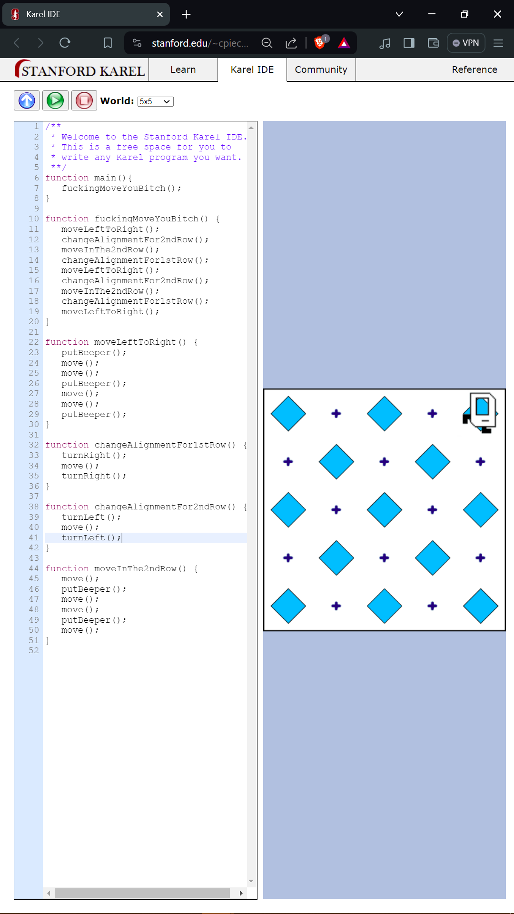

<h1 align="center" style="color: blue;">Introduction to Javascript</h1>

<h2 align="center"> Javascript - (Language that powers the web) </h2>

<p>The company that invested in all the major startups which are multi billion dollar companies like twitter, facebook, slack, skype, airbnb -
<span style="font-weight: bold;">"Andreessen horowitz" - Mark Andreessen.</span> In beginning before any internet explorer or any other search engine - there was <span style="font-weight: bold;">"Mosaic"</span> which Mark Andreessen worked on. And after then he created <span style="font-weight: bold;">Netscape.</span>
</p>

<p>For website to fetch data in early days, the html code or any other code will send the request to the data server to fetch the exact data. But it was tedious process.
Netscape want dynamic website where the code is rendered inside the browser, so they need a scripting language. So everyone can put functionalities to their website.</p>

<p>Without Javascript enabled on browser, we can see the mobile version of twitter where we can't simple compose the text or message someone or see how many words you have
written. In new york times, no adds will be loaded because add require javascript to render. Youtube and Netflix won't even load up without Javascript.</p>

So there were many version of javascript names. First it was called **Livescript**, then microsoft reverse engineer it and then said **Jscript** and then it was called
**Ecma Script** (Europeon Computer Manufacture Association.)

> ### Why it is called Javascript?
>
> In hero script, the script tell the actors to what they have to do in the scene, where same as scripting language tells what to do regards website.
> In **javascript**, it will tell the elements of html to what to do...

| Java                                         | Javascript                         |
| -------------------------------------------- | ---------------------------------- |
| Java is and interpreted programming language | Javascript is a compiler language. |

### You can refer Java and Javascript to it as (car and carpet.)

| Interpreted(very slow)(line by line execution) | Compiled(very fast) |
| ---------------------------------------------- | ------------------- |
| Java                                           | Javascript          |
| Pyton                                          | C/C++               |
| Ruby                                           | Swift               |

### Now modern javascript will be render in both front and back-end.

## Javascript -

<p>The Problem that we face in chrome developer tool in javascript console. It will execute the first and line and them move on to the second. Let's say I want to alert messages to be render simultaneously. It can't be happen due
to the limitation of chrome developer tool.</p>

> To run both alert simultaneously you have to press **"Shift + enter"** to run both the line simultaneously.

Another way of writing code of javascript inside chrome developer tool is to go to "sources" which is next right to "console". And then in the middle left you will see the dashboard where there are two arrows **">>"** like this.
And on clicking on that two arrows you will see the snippets. Click on new snippets, write the file name "index.js" and then start writing your code.
To run the program just press
**Ctrl+Enter**.

This snippet is similar to editor, where you write the whole code and then it will then execute that.

## 1. "Alert Keyword" -

Syntax -

```js
window.alert("Hello World!!!");
```

| keyword       | Meaning of this Keyword |
| ------------- | ----------------------- |
| alert         | Keyword of Function     |
| Hello         | Message                 |
| ; (semicolon) | end of Program          |

In programming or (Microsoft Word or Notes) there the quotes are different.

## 2. Data Types -

Way of classifying data to tell the computer how the programmer intense to use the data.

Example -

```js
alert("hello");
```

Here "hello" is the text which is closed inside the quotes which is telling the compiler that the text which is inclosed inside the quotes is a String kind of data type, that has to be rendered.

1. String of characters. Same as "String of pearls."
2. Numbers
3. Boolean

> ### **IMPORTANT** KEYWORD
>
> **(typeof)**. It will tell that what kind of data type you are using.

Syntax -

```js
typeof(23); output - Number;
typeof("Raja") output - String
typeof(true) output - boolean
```

## 3. Variables -

Let's say we use "prompt" keyword.
Syntax -

```js
prompt("What is your name").
```

A small window will appear with answer box. I will write my name. And then I will run the editor. It will show my name.
But this name will not be saved anywhere. And the next time when I ask the name that I have written before will not be executed as it was not save in the memory.
To do so we introduce **_variables_**.

In prompt keyword, Let' say you want to type the message. And what message you will type, you go to the other tab to copy and paste inside the prompt. But when return to the prompt, the prompt is closed and the error is given.

**"Uncaught TypeError: Cannot Read Property "length" of null"**.

Here null is refering to the empty message that you haven't given to the prompt.</p>
Syntax -

```js
var myName = "Raja";
```

Here "Raja" is a string datatype which is stored inside "myName" variable.
Now when I type myName inside the compiler, it will return me the value that was stored inside the variable "myName" which is in case "Raja".

Here **_"var"_** is a keyword which mean variables.
The keyword **_"var"_** will only be used once which is at the time of creating a particular variable.

Example -

```js
var myName = "Raja"; // Here it is only created once
myName = "Jane"; // Now I don't want the name Raja, instead I want to save "Jane" inside variable "myName". But this time I haven't written "var" again. Because it will automatically to which variable I am talking as it is already stored inside the memory.
```

Example -

```js
var yourName = prompt("What is your name?");
```

Here we are creating a variable name **_"yourName"_** which is storing the value of prompt function, which is in the case "What is your name?".
When I will write my name in pop-up window. It will automatically stored inside the variable **_"yourName"_**.

Example -

```js
var gameLevel = 1;
gameLevel = 2;
gameLevel = 3;
alert("Your level is currently: " + gameLevel);
// Every time the gameLevel is changing and then in the end it will popup in which gameLevel you are.
```

> **NOTE**
>
> - To delete the value in the variables, go to the reload button in browser and on left click you will see "Empty Cache and Hard Reload". Just do this all your data
>   that is stored inside the variable will be deleted.

### 4. Naming and Naming conventions for variables -

Always try to give good and meaningful name to your variables.
How can you give a meaningful name. Simply by looking what kind of data you are storing.

## Dont's -

### 1. Javascript will not recognise two vars.

```js
var var = aklfjasdlk; // Wrong method
```

Instead -

```js
var myVar = aflkjasl; // Right method
```

You can give **myVar** instead.

### 2. Your variable cannot begin with number.

Like -

```js
var 123 = 123; // This is wrong method.
```

Instead -

```js
var my123 = sdalf;
```

### 3. Your variable doesn't need to have space

Like -

```js
var my name = "Raja"; // There is a space which will not be executed.
```

Instead -

```js
var myname = "Raja"; // There is no white space
```

### 4. Your variable will only contain "characters", "names", "$", "\_".

Like -

```js
var my-name = "Angela"; // Here in my-name, the "-" will not be executed because it doesn't come under naming conventions.
```

Instead -

```js
var abc123$ = "Hello World";
```

It will not contain any other characters or other things.

The important way to write the variable name is by **"CamelCasing"** -

> First word is small, then follow up word first character will be capital.
> Example -

```js
var myName = "Raja Vanwani"; // Here my "m" is small and Name "N" is capital.
```

### 5. String Concatenation -

Example -

```js
var myFirstName = "Raja";
var myLastName = "Vanwani";
var concatenation = myFirstName + " " + myLastName;
alert("My Full Name is: " + concatenation);
console.log(concatenation);
```

### 6. To get the number of characters inside the string -

Syntax -

```js
(variable name).length;
```

Example -

```js
var name = "Raja";
```

    name.length; // There is no bracket after length which is indicating it is not a function.

### 7. Slicing and Extracting Parts of String -

Example -
Let's say in twitter we can only write the tweet upto 280 characters. If we place the longer message, the twitter automatically slice the message only upto 280 characters and the rest of the message is deleted.

Syntax -

```js
var name = "Raja Vanwani";
name.slice(0, 3); // name.slice(a, b) where a is the starting point and b is the point before the end point.
```

Let's say my name is "Raja". Now I want to slice this word from (0, 3);
Then only "Raj" will be the output. Means it will start from "0" and end (3-1) at location "2".

> Trick to know how many characters will come as output after slicing. Simply do **\(b-a)**

Example -

```js
var name = "Paul";
name.slice(0, 3);
// Apply the rule (b-a) which is (3 - 0). You will get "3". So, the answer is "Pau".
```

### 8. toUpperCase() and toLowerCase() -

Syntax -

```js
word.toUpperCase();
word.toLowerCase();
```

Example -

```js
var name = "raja";
name = name.toUpperCase;
name = name.toLowerCase;
```

---

## Basic Arithmetic and Modulo Operator in Javascript -

1. Addition

```js
var a = 2 + 3; // output "5"
```

2. Subtraction

```js
var b = 10 - 2; // output "8"
```

3. Multiplication

```js
var c = 3 * 3; // output "9"
```

3. Division

```js
var d = 4 / 2; //output  "2"
```

4. Modulo

```js
var e = 6 % 5; // output "1"
```

Example -

Here operator precedence will decide which operator should work first.
We first multiply and then add.

```js
var cost = 3 + 5 * 2; //output "13"
```

> **Note**

> For good programming practice, it is good to use brackets.

Question -

Convert Dogage to your Age-

```js
var dogAge = prompt("What is your dogage?");
var humanAge = (dogAge - 2) * 4 + 21;
alert("The Human Age is: " + humanAge);
```

---

## Increment and Decrement Operators -

Increment -

```js
var x = 5;
x++; // Same as x = x + 1. Answer will be 6;
```

Two types of increment are there (x++) and (++x). Let's say -

### (x++)

```js
var x = 3;
var y = x++; // In this case the value of x is assigned to y, before x is incremented
y += 1; // So the answer will be "4" here.
```

### (++x)

```js
var x = 3;
var y = ++x; // In this case the value of y will be assigned after incrementation of x.
y += 1; // So the answer will be "5" here.
```

Decrement -

```js
var x = 5;
x--; // Same as x = x - 1. Answer will be 4;
```

Two types of decrement are there (x-- ) and ( --x). Let's say -

### (x-- )

```js
var x = 3;
var y = x--; // In this case the value of x is assigned to y, before x is incremented
y -= 1; // So the answer will be "2" here.
```

### ( --x)

```js
var x = 3;
var y = --x; // In this case the value of y will be assigned after incrementation of x.
y -= 1; // So the answer will be "1" here.
```

> **Note or My theory**
>
> In case of (x++) increment **_Increase the answer by 1_** and in case of (++x) **_Increase the answer by 2_**.
> Same in the case of **decrement.**

---

## Functions

They allow you to create the set of instructions and pack them in block of code.

Syntax -

```js
// Creating a Function
function getMilk() {
  alert("LeaveHouse");
  alert("moveRight");
  alert("moveUP");
  alert("buyMilk");
  alert("moveLeft");
}
// Calling the code whenever we want, instead of repeating the commands again and again.
getMilk();
```

Instead of using **alert** keyword again and again and prompt will appear to click okay, so that the prompt will disapper.
We can use **console.log** which is same as **cout** in c++.
What **console.log** does is, it logs all the command of message and put it in the console for javascript. **Console** is a area in chrome inspection tool, which is at the bottom and there you will see all the outputs of the program that you have written.

```js
// Console.log Function Demonstration
function getMilk() {
  console.log("LeaveHouse");
  console.log("moveRight");
  console.log("moveUP");
  console.log("buyMilk");
  console.log("moveLeft");
}
// Calling the code whenever we want, instead of repeating the commands again and again.
getMilk();
```

### [Karel-Ide](https://stanford.edu/~cpiech/karel/ide.html) Chess Board Solution -



```js
function main() {
  fuckingMoveYouBitch();
}

function fuckingMoveYouBitch() {
  moveLeftToRight();
  changeAlignmentFor2ndRow();
  moveInThe2ndRow();
  changeAlignmentFor1stRow();
  moveLeftToRight();
  changeAlignmentFor2ndRow();
  moveInThe2ndRow();
  changeAlignmentFor1stRow();
  moveLeftToRight();
}

function moveLeftToRight() {
  putBeeper();
  move();
  move();
  putBeeper();
  move();
  move();
  putBeeper();
}

function changeAlignmentFor1stRow() {
  turnRight();
  move();
  turnRight();
}

function changeAlignmentFor2ndRow() {
  turnLeft();
  move();
  turnLeft();
}

function moveInThe2ndRow() {
  move();
  putBeeper();
  move();
  move();
  putBeeper();
  move();
}
```

## Parameters and Argument Function -

1. Non Argumentative and Non Parametive Functions -

   A functions without arguments and pararmeters.

```js
function getMilk() {
  // Write your code here
}
getMilk();
```

2. Parameterized Functions and Argumentative Functions -

   Functions containing parameters to pass.

```js
function getMilk(bottles) {
  var cost = bottles * 1.5;
  console.log("The price of " + bottles + " bottles is: " + cost);
}
getMilk(2);
```

Question -

Calculate the no. of bottles with given amount of totalMoney and price of each bottles.

```js
function noOfBottles(totalMoney, costOfMilk) {
  var noOfBottlesWithMoney = totalMoney / costOfMilk;

  console.log(
    "The no. of bottles from " +
      totalMoney +
      " will be " +
      Math.floor(noOfBottlesWithMoney),
  );
}
noOfBottles(10, 1.5);
```

3. Functions that return the values -

   The function that recives parameters and arguments and also returns the value.

Example -

```js
function noOfBottles(totalMoney, costOfMilk) {
  var noOfBottlesWithMoney = totalMoney / costOfMilk;
  var change = totalMoney % costOfMilk;
  return noOfBottlesWithMoney, change; // Here it will return the value.
  // Syntax for returning two things at once.
}

var totalMoney = prompt();
var noOfBottlesWithMoney,
  change = noOfBottles(totalMoney, 1.5); // Here it is catching the value and storing inside the variable noOfBottlesWithMoney
// In same order we have to recieve two values. If change is in second, it must be recived in the second variable.
console.log(
  "The no. of bottles from " +
    totalMoney +
    "$ will be " +
    Math.floor(noOfBottlesWithMoney),
);
console.log("The change will be " + change + "$");
```
