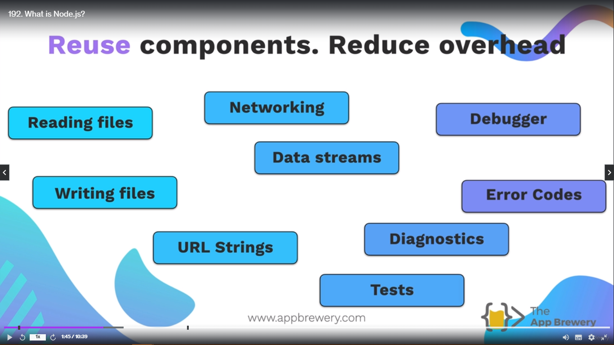
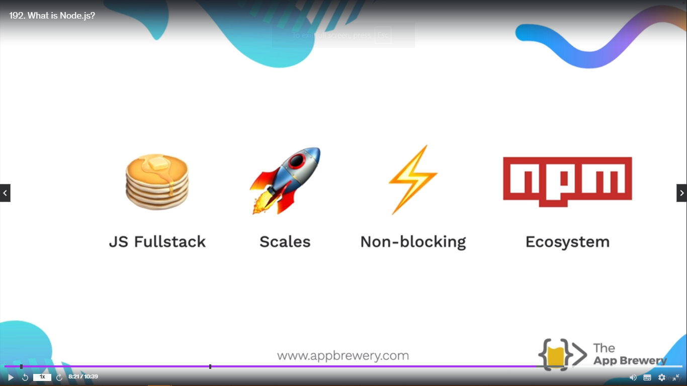

<h1 align="center" style="color: blue;"><span>NodeJS</span></h1>
<h2 align="center">What is NodeJS?</h2>

Why would you need a Frameworks anyways?

Example of **Mayonnaise**. Instead of making your own mayonnaise, buy the store maked mayonnaise. Same as two write the code from scratch, instead use the framework for the particular technology, which make the task easy.

Frameworks provide pre-built components and structures that can be used to build an application without the need for us to write every single line of code from scratch.



**_But NodeJS is an asynchronouse event-driven Javascript runtime, Node.js is designed to build scalable network applications_**

NodeJS use **V8 Engine** which is provided by chromium and it is written in C and C++.

When NodeJS was not there, Javascript is only used for making webpages, so it was pretty much locked, but when NodeJS comes it liberates the Javascript and it allows the freedom to write sort of any application, desktop or server side.

**Javascript Runtime** - Node provides us with this Javascript runtime so that we can run Javascript on a machine such as your own local computer.

**Asynchronous Event Driven** - Asynchronous means javascript code doesn't have to do everything sequentially. Synchronous meaning in code, Example let's say you ordered something on **Amazon**. If the site was Synchronous then we have to wait to to use the application untill our package was delivered. Event Driven meaning is that let's say your initiate your order and instead of having to wait for it, it can free up the resources and only when the event of the parcel being delivered does it then continue the run the next bits of code. So effectively, we can parcel up these bits of code into an event so that we know that our code can be triggered when this event happens.

> **NodeJS help to write the code in Javascript on backend side. It means we can use Javascript on both front-end and back-end.**
>
> **It helps in scaling the website that can be used for large professional projects.**
>
> **It's fast and it's non-blocking. It can be really fast and efficient due to Asynchronous event driven of NodeJS**.
>
> **It has a huge ecosystem. It's got a really vibrant community and people have contributed thousands of open-source modules and people have contributed to it.**



Top companies use NodeJS - Netflix, Twitter, Paypal, NASA and many more.

<h2 align="center">Using NodeJS</h2>

### Node REPL(Read Eval Print Loop) -

Is a computer environment where user inputs are read and evaluated, and then the results are returned to the user.
Type the command **Node** on terminal. You will see the **Node REPL**. You can directly write the code through terminal.

To **exit** from **Node REPL** use **Ctrl+C** two times.

> It is same as Javascript console on browser but instead on chrome we are using it locally on NodeJS.

To run the file through **Node** open the directory where you have kept your javascript file. Then type **"node [name of file]"** to run the code.

Example - **node index.js**

## Native Node Modules

They are like of **starting tool sets**.

Node has various features which makes it easier for you to create your application, especially on the server side.

You can think of native modules as the games that come locally pre-bundled on windows operating system like **Minesweeper**, **Pinball** etc. So native modules come pre-bundled with node.

Examples of Native Node Modules -

1. **File System** - It is the native node modules that allows us to access the local storage.

To use the native module of **File System** we want to import the code from NodeJS documentation about File System to your local file.

```js
// CJS
const fs = require("node:fs/promises");
```

```js
// ESM
import * as from "node:fs/promises";
```

In this module we will be using **CJS** **Common JS** pattern in order to get hold of the methods that we need from this File System module.

The method we are using **File Structure** **_fs_** is - **writeFile**.

```js
const fs = require("fs");

fs.writeFile("message.txt", "Hello From Raja Vanwani", function (err) {
  if (err) throw err;
  console.log("The file has been saved.");
});
```

Here we are using **File System** Native node module.

First parameter is the **file name** that you want to write on. In my case it is "message.txt". It it is there then it will change the name or if it is not there then it will create the file **message.txt**. That's why I am not writing relative path inside the first parameter string.

Second Paramter is **data** - What you want to write in the file.

Third Parameter is **callback function** - It will return me the message if the file is there or created and If the error is there it will throw the error.

### Challenge -

Change the message.txt file. Read the **Message.txt**. And then print the text in the terminal.

```js
fs.readFile("./message.txt", "utf-8", function (err, data) {
  if (err) throw err;
  console.log(data);
});
// If option parameter "utf-8" was not given it will give me buffer with all the letters *HEX* Value.
```

<h2 align="center">NPM (Node Package Manager)</h2>

It helps in getting to access the world of open source node packages.

NPM - Basically it's a place which collects modules that people have build for node and it's created by the github organization and it's a really great place to find code that other people have written with utilities and tools to help you with writing your Node application.

NPM is like **community tool library**. So NPM is open-source where developers have created tools that other developers can use without writing the code from scratch. So it is a **shared code library**.

> **Scroll throught the project given in the resources. Type **npm init** in terminal. This will generate few questions. Answer it then it will create the file **package.json** file for your project which acts like the **configuration file** for your project. It is the way of representing our data, the Javascript object notation. It is very similar to the way that Javascript objects are structured and it's just a key values pair describing all of the things that we've entered just now.**

To install NPM Pacakges -

Type **_npm install "package_name"_** or **_npm install "package_name" "package_name" "package_name"_**

Example -

**npm i sillyname**

```js
// It will generate some sillyname from "sillyname" node package.
// To search for package files and folders look into node_modules folder.
var generateName = require("sillyname");

var sillyname = generateName();
console.log(`My name is ${sillyname}.`);
```

### ECMAScript Modules

When we use **CJS** or Common Javascript we use **require** keywords for node native modules as well as npm modules.

So from node version 12 we have also enable ECMAScript.
The keyword is **import**.

To enable ECMAScript to use inside javascript we have to change our configuration file which is **package.json**

```json
"type": "module",
```

Now we can remove this line of code.

```js
var generateName = require("sillyname");

var sillyname = generateName();
console.log(`My name is ${sillyname}.`);
```

To move into -

```js
import generateName from "sillyname";

var sillyname = generateName();
console.log(`My name is ${sillyname}.`);
```

> **NOTE:**
>
> The meaning of the line console.log(`My name is ${sillyname}.`);
>
> **``** - These are called **Template literals** combined with dollar sign offers a convenient way to create dynamic strings by embedding variable values directly within the string. While regular strings ("") are suitable for fixed text, but require concatenation (+) to insert variable values

```js
const name = "Iron Man";

// Using Template Literal
console.log(`I am ${name}!`); // Output: I am Iron Man!

// Using Regular String (requires concatenation)
console.log("I am " + name + "!"); // Output: I am Iron Man!
```

### Challenge

Generate random superHeroes name

```js
import { randomSuperhero } from "superheroes";

const name = randomSuperhero();

console.log(`I am ${name}!`);
```
