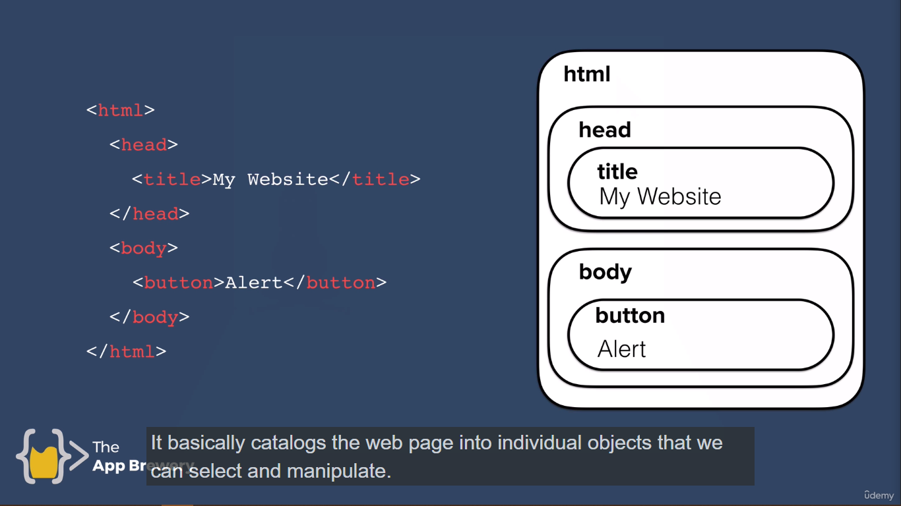

<h1 align="center" style="color: LightGreen;">The Document Object Model (DOM)</h1>

## Adding Javascript to Website -

Let's create a simple index.html file to demonstrate how javascript works inside html.
As there **3** ways to add css inside html -

1. Inline CSS
2. Internal CSS
3. External CSS

There are the same ways to add javascript code inside html to render.

1. Inline Javascript

```html
<!doctype html>
<html lang="en">
  <head>
    <meta charset="UTF-8" />
    <meta name="viewport" content="width=device-width, initial-scale=1" />
    <title>My Website</title>
    <link href="./style.css" rel="stylesheet" />
  </head>
  <!--Here the onload attribute is used. Which means that when the body of html is loaded it will first carried out the "onload" function.-->
  <body onload="alert("Hello");">
    <h1>Hello</h1>
  </body>
</html>
```

> **NOTE**
>
> In above case when we are writing <body onload="alert("Hello")"></body>. The code compiler get confused as there are two quotation marks -
>
> 1. "alert()" // One is for alert function
> 2. "Hello" // Other is for the message inside the alert function.
>
> So, the compiler get confused and estimates that alert() is kind of string. To prevent this to happen, we have to **downgrade** the quotation marks.
>
> Example - **body onload="alert('Hello')"></body**
>
> Here we have dowgraded the message function to use only single quotation mark which is ('Hello')

The Revised code after dowgrading the function is -

```html
<!DOCTYPE html>
<html lang="en">
  <head>
    <meta charset="UTF-8" />
    <meta name="viewport" content="width=device-width, initial-scale=1" />
    <title>My Website</title>
    <link href="./style.css" rel="stylesheet" />
  </head>
  <!--Check for this part-->
  <body onload="alert('Hello');">
    <h1>Hello</h1>
  </body>
</html>
```

### Downside of Inline Javascript -

<ul>
<li> It's not very modular.</li>
<li> It's difficult to debug.</li>
<li> It is not a good practice.</li>
</ul>

---

2 . Internal Javascript -

```html
<!DOCTYPE html>
<html lang="en">
  <head>
    <meta charset="UTF-8" />
    <meta name="viewport" content="width=device-width, initial-scale=1" />
    <title>My Website</title>
    <link href="./style.css" rel="stylesheet" />
  </head>
  <body>
    <h1>Hello</h1>
    <!--Internal Javascript-->
    <script type="text/javascript">
      alert("Hello");
    </script>
  </body>
</html>
```

---

3. External Javascript -

```html
<!DOCTYPE html>
<html lang="en">
  <head>
    <meta charset="UTF-8" />
    <meta name="viewport" content="width=device-width, initial-scale=1" />
    <title>My Website</title>
    <link href="./style.css" rel="stylesheet" />
  </head>
  <body>
    <h1>Hello</h1>
    <!--Include the external Javascript File-->
    <script src="./index.js" charsert="utf-8"></script>
  </body>
</html>
```

```js
// index.js file
alert("Hello World");
```

> **NOTE :**
>
> It is important where we put this line "script" tag inside the html. Let's say if we put this css file inside the body part after h1 tag and script tag. First the website get loaded then script tag will be rendered which say alert("Hello World") and then the css part is carried out. But we don't want this. When the website get loaded all the external css we have written must be loaded first and then the body of the html.
>
> The HTML follow the **Top-Down** approach.
>
> So we have to put the css file in the header part of html with "link" tag.
>
> But in case of javascript we have to put the script tag at the end of closing body tag.

```html
<!DOCTYPE html>
<html lang="en">
  <head>
    <meta charset="UTF-8" />
    <meta name="viewport" content="width=device-width, initial-scale=1" />
    <title>My Website</title>
    <link href="./style.css" rel="stylesheet" />
  </head>
  <body>
    <h1>Hello</h1>
    <!--We have to put the script tag above the closing body tag-->
    <script src="./index.js" charsert="utf-8"></script>
  </body>
</html>
```

> This is because let's say if we put the "script" tag above.

```html
<!DOCTYPE html>
<html lang="en">
  <head>
    <meta charset="UTF-8" />
    <meta name="viewport" content="width=device-width, initial-scale=1" />
    <title>My Website</title>
    <link href="./style.css" rel="stylesheet" />
    <!--We have put the the script tag above.-->
    <script src="./index.js" charsert="utf-8"></script>
  </head>
  <body>
    <h1>Hello</h1>
  </body>
</html>
```

```css
h1 {
  color: red;
}
```

```js
document.querySelector("h1").innerHTML = "Good Bye";
// Here the  document is that to look inside the index.html file.
// Query Selector is to look for a specific tag or attribute inside the index.html file. Here it is reffering to "h1"
// Inner HTML is reffering to that is you find that specific tag then change the text which is given inside that particular tag, which is in this case to change "Hello" text to "Good Bye".
```

> So what will happen in this case?
>
> First css file is loaded which is telling to put the h1 tag to red in color
>
> Now the javascript file is loaded. So inside the javscript file querySelector will look inside the html file and try to find the "h1" tag, but in this case "h1" is not yet created, as html follow top-down approach. So this javascript will generate error **NULL**.
>
> And then h1 tag is loaded and it's color will change to red in color. But our Javascript text "Good Bye" is not loaded.
>
> So it is the good practice to write your javascript tag of external javascript above the **_closing_** body tag.
>
> Let's say you have implemented a highly functional javascript to your library. As it is place below the closing body tag. All the html and css file be loaded, so that the user will see all the part of that particular website which is **_UX_** Design of the website. And then since javascript is higly functional it will loaded in some time. So, this will not create problem for the user as he will first see the website and then started to use the functionalities of it.

---

## Introduction to DOM

Dominating the DOM to add functionality to HTML elements.

Up util now our website was static. We basically planned what content our website should have and also the appereance of that content.

If we want our website to be interactiv, we have to change the parts of the website on fly.

When we click on the buttome there is change on the appereance of our website.

DOM basically catalogs the web page into individual objects that we can select and manipulate.



### The task of converting the html code to DOM is done by the browser when you load up the web page.

### And what it does, it turn all the related element and there text into **_TREE_** Structure.


> You can see that all of the elements in our HTML has been converted into objects, and their relationships to each other mapped out in the tree diagram above.

Use the chrome extension [HTML Tree Generator](https://chromewebstore.google.com/detail/html-tree-generator/dlbbmhhaadfnbbdnjalilhdakfmiffeg) to visualize that how browser converts all the html code to DOM Tree Structure.

### Exercise the demonstrate the DOM Structure -

Refer HTML, CSS and Javascript File inside the DOM Folder, to get the code.

1. To get DOM Structure inside console

```js
document;
```

2. To get the DOM first child inside console.

```js
document.firstElementChild;
// This will return the first child which is in this the whole code starting from first child  which <html></html> tag
```

3. To get first Element first child.

```js
document.firstElementChild.firstElementChild;
// It will return me the <head></head> tag.
```

4. To get the first element last child

```js
document.firstElementChild.lastElementChild;
// It will return me the <body></body> tag.
```

5. Now to select the tags inside the body tag.

```js
document.firstElementChild.lastElementChild.firstElementChild;
// In this case it will return me <h1></h1> tag in the code of html.
```

6. To Manipulate the heading text of h1 tag

```js
var heading = document.firstElementChild.lastElementChild.firstElementChild;
heading.innerHTML = "Good Bye".
// Here we are saving the <h1></h1> tag inside the heading variable.
// Then we are changing heading innerHTML which is "Hello" to "Good Bye"
```

> That's how we will change the website on the fly using the DOM.

7. To change the color of h1 tag

```js
var heading = document.firstElementChild.lastElementChild.firstElementChild;
heading.style.color = "red".
// It will change the color of h1 tag to red which is now "Good Bye";
```

8. To do some actions.

```js
document.querySelector("input").click();
// Here we are saying in the document structure go through from top to bottom using (querySelector) (which is same as Searching in C++) inside the DOM Structure and look for tag <input> and then if you find that change the option to mouse click. Means it will directly change the the checkbox to check without clicking on the checkbox.
```


> Here the object has properties and methods.
>
> Properties tell something about the object.
>
> Methods are the things that the object can do.

In case of car it has some properties and methods and in similar case we can change the object methods and properties through **_DOT_** Notation.

### 1. Getter Property

Example -

car.color;
It will return me the value which is in this case is red color.

### 2. Setter Property

Example -

car.numberofDoors = 0; // It will set the value which is in this case is to set the car number of doors to be 0.

### 3. Call Method

Example -
car.drive();

| Method                     | Function                                                    |
| -------------------------- | ----------------------------------------------------------- |
| This is done by the object | While functions are global and are referring to everything. |

Example -
button Tag Properties -

1. innerHTML
2. style
3. firstChild

Methods -

1. click();
2. appendChild():
3. setAttribute();

### Challenge -

To select the last list item which has text "Third" and change it into "Raja".

```js
document.querySelector("ul").lastElementChild.innerHTML = "Raja";
```

Angela's Method:

```js
document.firstElementChild.lastElementChild.querySelector(
  "ul"
).lastElementChild.innerHTML = "Raja";
```

---

## Selecting HTML Elements With Javascript

### 1. Get Element By Tag Name

```js
document.getElementsByTagName("li");
// Elements is plural here, means it will fetch all the element which is present in the DOM Structure and return them in the form of array.
```

> If we do this then it will give me all the 3 list items inside index.html in the form of array.

If we set the property the color property of list items to purple color.

```js
document.getElementsByTagName("li").style.color = "purple";
```

> This will generate error, because we are trying to set the color of array of list.

To select the particular list item to change the color to puple we have to set the position of that element inside the array.

```js
document.getElementsByTagName("li")[0].style.color = "purple";
```

To get the lenght of the array of all the list tag.

```js
document.getElementsByTagName("li").length;
```

### 2. Get Element By Class Name

It allows you to select elements based on the name of the class.

```js
document.getElementsByClassName("btn");
// Similar Elements are plural so it will return me an array. Instead I am having only one btn class, It will return me an array with only one element which lenght is only 1.
```

Wrong -

```js
document.getElementsByClassName("li").style.color = "purple";
// This doesn't work again because it will return an array.
```

Instead, Do This -

```js
document.getElementsByClassName("li")[0].style.color = "purple";
```

### 3. Get Element By Id

Return the element with having Id.

```js
document.getElementById();
```

> NOTE:
>
> In this case the word **Element** is not plural because there will by only one id associated with the element.

To manipulate the id -

```js
document.getElementById("title").innerHTML = "Good Bye";
```

### 4. Query Selector

This will only return me the single value but it is different from getElementById because it uses selectors. Selectors are used in css.

> **NOTE:**
>
> In the case of querySelector we can use everthing whether it is id, class or elements.

Different Ways of using querySelector

> All this code is inside index.html. From there I am referring.

```js
document.querySelector("#title"); // ID

// Output -
{
  /* <h1 id="title">Hello</h1> */
}
```

```js
document.querySelector(".btn"); // Class
//Output -
{
  /* <button class="btn">Click Me</button> */
}
```

```js
document.querySelector("h1"); // Element
// Output -
{
  /* <h1 id="title">Hello</h1> */
}
```

```js
document.querySelector(#list a); // Getting hierarchial combinations of elements
```

```js
querySelector("li.item"); // Getting particular list item with having particular class combination.
```

> **NOTE:**

If let's say I have one identifier and 3 elements with same class.

```html
<ul id="list">
  <li class="item">
    <a href="https:www.google.com">Google</a>
  </li>
  <li class="item">Second</li>
  <li class="item">Third</li>
</ul>
```

In this case if we do this -

```js
document.querySelector("#list .item");
// It will return me only the first one list element.
// which is <li class="item"><a href="https:www.google.com">Google</a></li>
```

But if we want all the three list items with same class and one identifier.

```js
document.querySelectorAll("#list .item");
// It will return me all the three list items.
{
  /*NodeList(3) [li.item, li.item. li.item]*/
}
```

> In this case we will get a **NodeList**, same as LinkedList in C++.
>
> Same in this case if we want to manipulate actions inside particular list in the given NodeList, we will use indexing.

```js
document.querySelectorAll("#list .item")[2].style.color = "purple";
```

Now, we have seen so much methods of selecting elements inside html through javascript, but which one should we use.

> ### querySelector and querySelectorAll can use to solve more complex queries because we're able to specify id, class, element, tag, names and combine them in order to target the exact element we want.
>
> ### Whereas the getElement methods are more broad and it's more difficult to target individual object without going into change in HTML.
>
> ## So we will use querySelector and querySelectorAll to do all the things to do with the getElement methods.

Challenge -
To change the color of anchor tag inside the List element.

```js
// one method
document.querySelector(".item a").style.color = "red";
// second method
document.querySelector("#list .item a").style.color = "red";
// third method
document.querySelector("li a").style.color = "red";
```

## Manipulate the HTML Elements that we've selected

We can change the style property of css dynamically through javascript

```js
document.querySelector("h1").style.color = "red";
```

If we want to change the font-size through CSS of an element

```css
h1 {
  font-size: 10rem;
}
```

But in case of Javascript

1. We use **_camelCasing_** to name the CSS property. There is no **-** in between properties like "font-size".
2. The value that has to be set must be a **String** in Javascript while it is not a string, but a value in CSS.

Example -

```js
document.querySelector("h1").style.fontSize = "10rem";
```

For more properties of css to change through javascript got [DOM Style](https://www.w3schools.com/jsref/dom_obj_style.asp) for more info.

Challenge -

To change the background color of button element.

```js
document.querySelector(".btn").style.backgroundColor = "yellow";
```

---

## The Separation of Concerns: Structure vs Style vs Behaviour

We have to keep idea that HTML is for **content** only, CSS is there for **styling** and Javascript is there for **behaviour**.
But we are not doing this because we are trying to change the style of website using javascript and not css.

But Let's say the user want to change the style on go, let's say If I hover my mouse over button tag, it's background color will change to something else. So it will be a better option to change the css property using Javascript right?

There is usually another way -

### ClassList

It's a property of every DOM Object.

Example -

```js
document.querySelector("button").classList;
// It will me the classes that are attached to this element.
```

So what this property do, is that it will give me the classes that are associated to that particular element. Then we can create a **class** inside the particular element let's say here is button. And we can **turn on or off** this class through javascript and we can give the style through css.

**In short, we can keep all the styling inside CSS, add extra class through javascript for particular feature to get turn on or off in fly mode inside html.**

Example -

1. Turn on Method:

```js
document.querySelector("button").classList.add("invisible");
```

```html
<button class="btn invisible">Click Me!</button>
```

```css
.invisible {
  visibility: hidden;
}
```

2. Turn off Method:

```js
document.querySelector("button").classList.remove("invisible");
```

3. Toggle Method:

Toggle method is used when if the class invisible is applied then turn it off and if not applied then turn it on. This method is useful for debugging the code.

```js
document.querySelector("button").classList.toggle("invisible");
```

> Now there is no need to apply the css through javascript. We can simple add the class through javascript to particular variable and add propety through css. And then turn it on or off through javascript on our needs.

---

## Text Manipulation and Text Content Property

We can change the text in html through javascript by using **innerHTML**.

```js
document.getElementById("title").innerHTML = "Good Bye";
```

Another Method is by using **textContent**

```js
document.getElementById("title").textContent = "Hello";
```

Difference between **innerHTML** and **texContent**

innerHTML - it will give me all the things inside the particular element.
Let's say my HTML Code looks like this

```html
<h1 id="title"><strong>Hello World</strong></h1>
// In this case, if innerHTML is called it will return me the value - { /*
<strong>Hello World</strong>*/ }
```

Everything inside the h1 tag with id="title".

We can also add element inside the elements using innerHTML

```js
document.querySelector("h1").innerHTML = "<em>Good Bye</em>";
```

textContent - it will only give me the text inside the element whether it is having another element inside.

```html
<div>
  <h1><a>Hello World</a></h1>
</div>
```

```js
document.querySelector("h1").textContent = "I have changed!";
```

In the above case it will change the value of **Hello World** to **I have changed!** which is inside the anchor tag.

---

## Manipulating HTML Element Attributes

Attributes are the properties define inside the element.
Example -

```html
<h1 class="id">Hello World</h1>
// class is an attribute

// src is an attribute.
```

Exercise -
To change the anchor tag location from "https://www.google.com" to "https://www.bing.com"

```js
document.querySelector("a");
// output -
// <a href='https://www.google.com'>Google</a>
```

To get the attribute of this particular anchor tag.

```js
document.querySelector("a").attributes;
// It is plural.
// If there are more attributes then it return me the map
// in which key is attributes and value in the count of that attributes.
// output -
// NameNodeMap
// {0: href, href: href, length: 1};
// Means it has only one attribute which is href
```

To get the value of this particular anchor tag. We will use **getter** property.

```js
document.querySelector("a").getAttribute("href");
// output -
// https://www.goggle.com
```

To set the property of this particular attribute to point towards bing.com instead google.com. We can use **setter** property. It will have to parameter.

1. Which attribute
2. Value of that attribute to change.

```js
document.querySelector("a").setAttribute("href", "https://www.bing.com");
```

```flowchart
st=>start: Start|past:>http://www.google.com[blank]
e=>end: End|future:>http://www.google.com
op1=>operation: My Operation|past
op2=>operation: Stuff|current
sub1=>subroutine: My Subroutine|invalid
cond=>condition: Yes
or No?|approved:>http://www.google.com
c2=>condition: Good idea|rejected
io=>inputoutput: catch something...|future

st->op1(right)->cond
cond(yes, right)->c2
cond(no)->sub1(left)->op1
c2(yes)->io->e
c2(no)->op2->e
```
