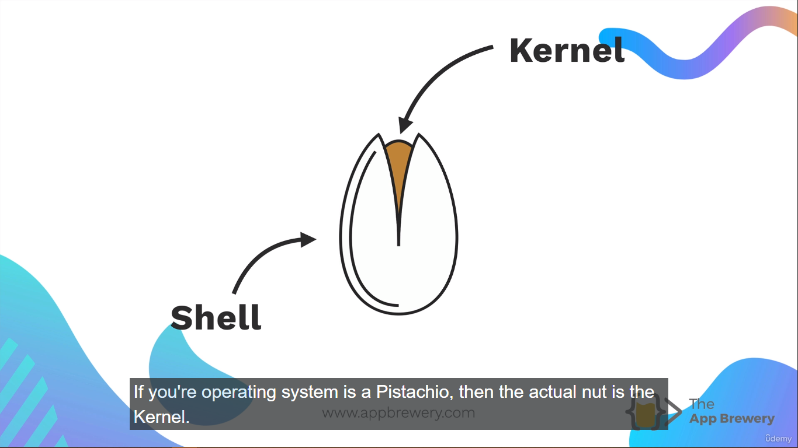
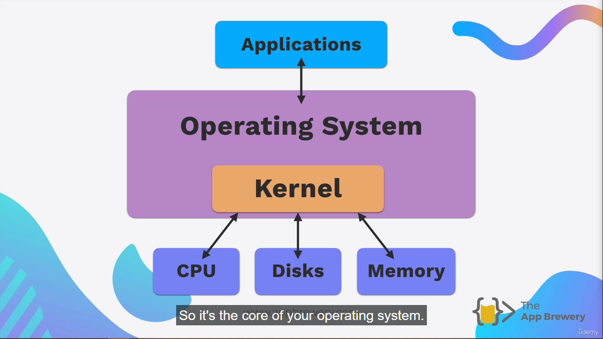
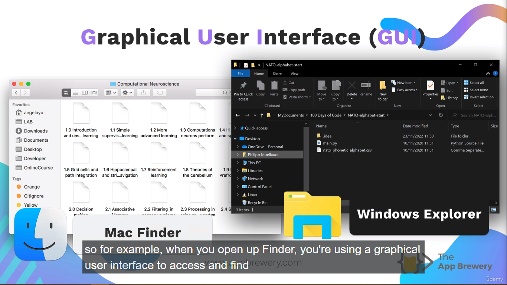
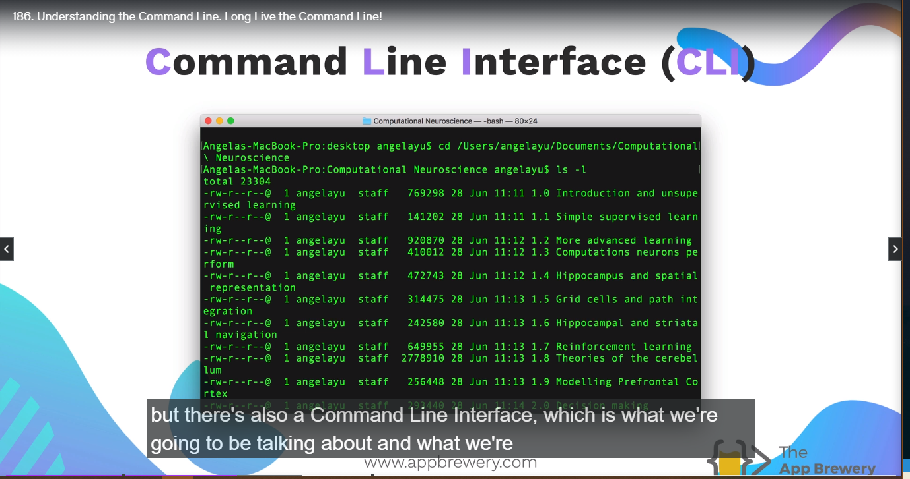

<h1 align="center" style="color: blue;">
  Unix Command Line Cheat Sheet
</h1>

## Install Git Bash on Windows

Navigate through [Gi](https://gitforwindows.org/) to download.

Just make ensure **Windows Explorer Intergration** checkbox is checked for both

1. Open Git Bash Here
2. Open Git Gui Here.

> **NOTE:**
>
> Since, I used **WSL**, and it comes with pre-installed git, so there is no need to externally install git on windows.

## Command Lines -

What is bash shell?


**Kernel**

Kernel refers to the actual program that interfaces with the hardware. So, it's the core of your operating system.



**Shell**

Shell in computing refers to the user interface for you as a human to be able to interact with the kernel and in turn the hardware of the computer.

### Types of Kernel -

1. Graphical User Interface Kernel -

 

2. Command Line Interface Kernel -



## BASH (Bourne Again) Shell

It is a **CLI (command line interpreter)** for the unix system.

Example of Unix System -

1. Linux
2. Macos - 10

> Why use CLI if GUI is availabe?
>
> It's because about the speed and lot about control.
> GUI used to hide a lot of the complicated stuff like configuration files from the common user.
> But will **CLI** you have full control and you have a lot of flexibility.

## Directory Navigation

> **NOTE:**
>
> **~** symbolizes that I am in my current **Home** Directory.

**1.ls** - (List all the files inside the current)

**2.cd** - (changing directory)

> For Last Command in your history - Press **Up Arrow**
>
> **"../"** - Change directory to go one step backward.
>
> **"./"** - In my current directory.

## Creating, Opening and Removing Files through the Command Line

**1.mkdir** - make the directory inside the current working directory.

```bash
mkdir images
```

**2.touch** - create the files inside the current working directory.

Example -

```bash
touch hello.cpp
```

**3. Open** - Open the files with current default app associated with the file.

```bash
open hello.cpp
```

Opens the files with app associated to hello.cpp. In my case it will open in Visual Studio Code.

**NOTE**
If you have other apps to open a particular file, you can specify the **flag** with it.

Example -

```bash
open -a Applications/Visual\ Studio\ code.app hello.cpp
```

Specifying the path of the app.

**4. rm** - Delete the particular specified file or files.

**5 pwd** - (print working directory) specify the path of your current working directory.

**5. rm for all files** - remove all the files inside the current working directory.

- "\*" is a wildcard character to specify all.

```bash
rm *
```

> **NOTE**
>
> You have to be careful when using certain commands because the GUI isn't there to protect you. If let's say you are in your **HOME** directory and then you remove all the files, it will damage the CLI. So always check in which working directory you are.

**6. rm -r** - to remove the **folder** you want to delete.

**7. Sudo** - **(Super User Do)** which uses your admin privileges.

**8. rm -rf** remove the folder specified by the user forcely, by not asking the rights to delete.

**9. sudo rm -rf --no-preserve-root/** - remove the admin privileges all files and folders (child folders, current folders) forcefully and wipe out all the hardisk files from where it is no longer to recover it and your system crashes.

Refer this [Monday Morning](https://serverfault.com/questions/587102/monday-morning-mistake-sudo-rm-rf-no-preserve-root) article to get the clear view of what I am saying by the above command.

For more Command Lines, refer to this [article](https://www.learnenough.com/command-line-tutorial).
